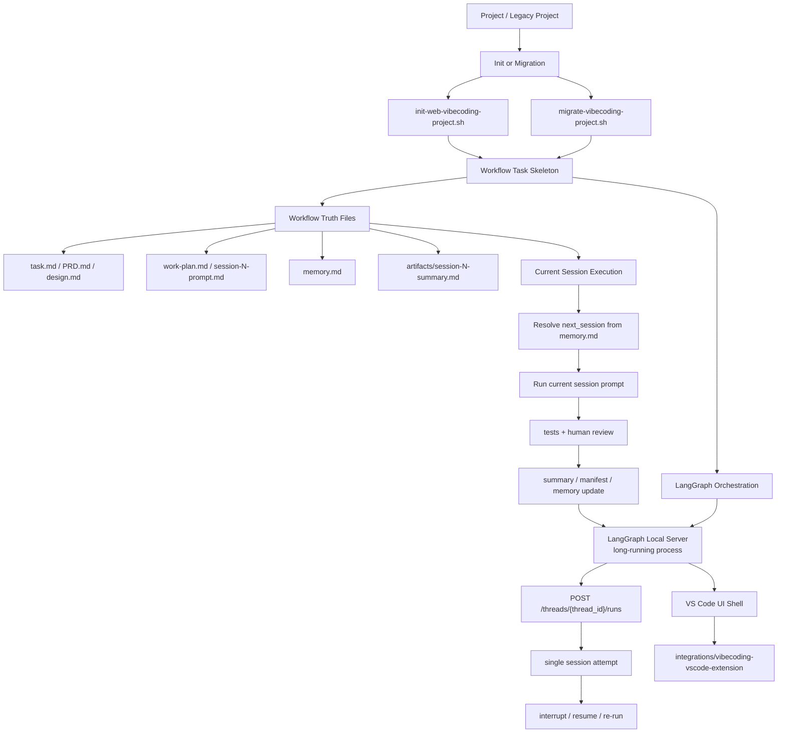

# vibecodingworkflow

Standalone workflow kit for multi-session webcoding projects.

> 2026-03-17 设计更新：推荐执行模型已调整为”LangGraph Local Server 常驻 + 单 session 显式触发 + 人工验收后才推进”。
> 2026-03-18 交付模型更新：新增 `1paperprdasprompt.md` 单文件交付模式，客户无需 clone 整个工程。

This project is intentionally generic. It does not contain business data, business
source code, or any feature-specific runtime logic. It only provides:

- **`1paperprdasprompt.md`** — 单文件交付模式：客户只需 clone 此文件，让大模型读取后即可完成项目初始化和全流程执行
- task-level workflow entry
- startup routing prompt
- memory/status template
- session summary handoff template
- work plan template
- PRD/design/CLAUDE templates
- session 0 to 10 prompt templates
- reference docs for evidence, output shape, and testing
- a bootstrap script to generate a new workflow-driven project
- a migration script for older prompt-only workflow projects
- a LangGraph-oriented orchestration model, with the legacy fresh-session driver archived for reference only

This repository also now carries one companion integration module under
`integrations/`:

- `integrations/vibecoding-vscode-extension/`: VS Code UI shell for the fresh-session workflow, including fixtures, reports, and extension validation scripts
- Current checkout validation on 2026-03-17 confirmed `./scripts/verify-vibecoding-workflow.sh`, `PYTHONPATH=src ./.venv/bin/python -m unittest discover -s tests -p 'test_*.py'`, `PYTHONPATH=src ./.venv/bin/python scripts/run_langgraph_test_suite.py`, `PYTHONPATH=src ./.venv/bin/python scripts/test_langgraph_hitl_http.py`, `npm run smoke:session8`, `npm run regression:session9`, and `npm run smoke:session11` all pass.

## Execution Model

The recommended model is:

- `Project -> Task -> Session -> Artifact`
- Session 0 produces all planning docs + pre-generates `tasksubsession1.md ~ tasksubsessionN.md`
- User manually executes each session: `"请读取 tasksubsessionN.md 并执行"`
- `memory.md` is a human-readable progress log, not a runtime routing source
- No LangGraph server, no VSCode extension required — zero runtime dependencies

## Claude Code Usage

For human-driven repository work in Claude Code, the recommended operating model
is a separate planning pass followed by an execution pass:

| Pass | Command | Use it for |
|---|---|---|
| Planning | `claude --model opusplan --permission-mode plan` | read the repository, identify affected files, and produce an implementation plan before any edits |
| Execution | `claude --model opusplan --permission-mode acceptEdits` | apply the approved plan as the smallest verifiable slice |

Notes:

- `opusplan` is the preferred model alias because it uses stronger planning behavior in `plan` mode and switches to a cheaper/faster execution behavior outside `plan` mode.
- If you want explicit 1M context for both passes, configure your shell before starting Claude Code:

```bash
export ANTHROPIC_DEFAULT_OPUS_MODEL='claude-opus-4-6[1m]'
export ANTHROPIC_DEFAULT_SONNET_MODEL='claude-sonnet-4-6[1m]'
```

- With the above environment variables, `opusplan` uses `claude-opus-4-6[1m]` in the planning pass and `claude-sonnet-4-6[1m]` in the execution pass.
- Use 1M context for large repositories and long-running design analysis; expect higher latency and cost than the non-`[1m]` defaults.
- Claude `plan` / `acceptEdits` are tool interaction modes. They do not replace workflow business state such as `current_phase`, `next_session`, or `session_gate`.
- For Session 0 planning, cross-file refactors, and rejected-review re-plan, start with the planning pass first.
- Command execution is still constrained by repository permission policy such as `.claude/settings*.json`.

Typical operator loop:

1. Run `claude --model opusplan --permission-mode plan`
2. Ask Claude to inspect the relevant `README.md`, `docs/`, implementation files, and tests
3. Review the file list, implementation order, validation commands, and risks
4. Run `claude --model opusplan --permission-mode acceptEdits`
5. Instruct Claude to implement only the approved slice, then verify and review before advancing workflow state

This means the orchestrator may know that a run is currently active, resumable, interrupted, or failed, but only `memory.md` decides whether Session N is officially complete and whether Session N+1 may start.

## LangSmith Studio Setup

This repository's [`langgraph.json`](./langgraph.json) declares `env: ".env"`.
When you open a local thread in LangSmith Studio, the local LangGraph server must
therefore start from the repository root with a `.env` file that includes
`LANGSMITH_API_KEY`.

Minimal setup:

```bash
cp .env.example .env
```

Then edit `.env` and set your real LangSmith key:

```bash
LANGSMITH_API_KEY=lsv2_pt_...
```

If Studio shows `Not seeing LangSmith runs?`, first confirm:

- `.env` exists in the repository root
- `LANGSMITH_API_KEY` is set in that file
- you restarted `langgraph dev` after editing `.env`
- your Studio link still points at the active local server, typically `http://127.0.0.1:2024` or `http://localhost:2024`

The workflow status contract is:

- `current_phase`: `design | development | done`
- `last_completed_session_tests`: `n/a | passed | failed | blocked`
- `session_gate`: `ready | blocked | in_progress | done`



See [docs/workflow-standard.md](./docs/workflow-standard.md) for the full `Project / Task / Session / Artifact / Memory` model and diagram.

See [docs/real-world-guide.md](./docs/real-world-guide.md) for the **real-world execution guide** — how to handle multi-round review cycles, context window switching with `nss))`, and when to advance `memory.md`.

See [1paperprdasprompt.md](./1paperprdasprompt.md) for the **single-file delivery model** — the complete workflow spec in one document for LLM-driven project initialization.

## Use Cases

Use this project before or during webcoding development when you need:

- a fixed `startup -> memory -> session` loop
- a recoverable workflow based on one fresh session per deliverable
- session-level test gates
- a reusable prompt/doc skeleton for new projects

## Quick Start

### 方式一：单文件交付（推荐，适合产品经理 / 新项目）

1. 在你的项目目录下放入 `1paperprdasprompt.md`（可直接从本仓库 clone 单文件）
2. 让大模型读取该文件：

```
请读取 1paperprdasprompt.md，然后按照其中的入口协议开始执行。
```

大模型会自动判断项目状态，引导你完成 Session 0（产出全部规划文档），然后按 Session 循环推进开发。

### 方式二：脚手架初始化（适合需要完整模板结构的团队）

```bash
cd /Users/beckliu/Documents/0agentproject2026/googledrivesyn/skills/vibecodingworkflow
./scripts/init-web-vibecoding-project.sh my-web-feature /path/to/parent --git-init
```

The generated project will contain its own workflow files and can be used
independently from this template repository.

## Legacy Project Migration

Older workflow projects that do not yet contain `task.md` can be upgraded with:

```bash
./scripts/migrate-vibecoding-project.sh /path/to/legacy-project
```

The migration is intentionally non-destructive. It adds the missing task-centered
artifacts but does not overwrite the project's existing workflow or product docs.
See [docs/legacy-project-migration.md](./docs/legacy-project-migration.md).

## Legacy Fresh Session Driver

This repository also includes:

```bash
python3 ./scripts/archived/run-vibecoding-loop.py /path/to/project --print-startup
```

It is an archived external orchestration prototype kept only for historical comparison and emergency manual inspection. The active runtime and design baseline are now LangGraph Local Server.

The next-session spec contract is documented in
[templates/references/output-schema.md](./templates/references/output-schema.md).

## Project Structure

```text
vibecodingworkflow/
├── README.md
├── 1paperprdasprompt.md   ← 单文件交付模式，客户使用入口
├── SKILL.md
├── .gitignore
├── docs/
├── integrations/
├── scripts/
└── templates/
```
