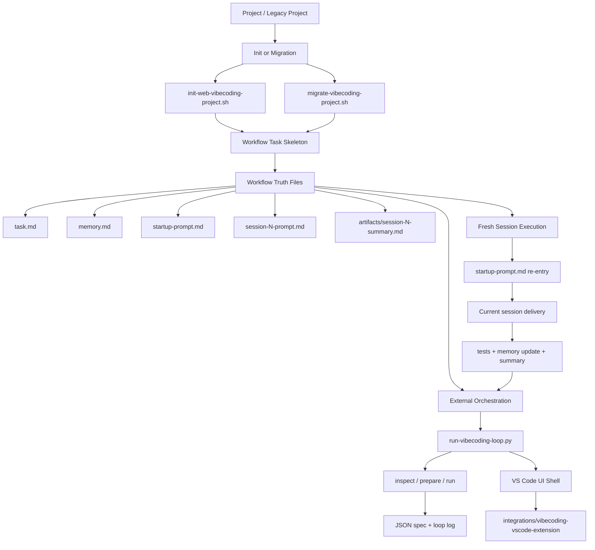

# vibecodingworkflow

Standalone workflow kit for multi-session webcoding projects.

This project is intentionally generic. It does not contain business data, business
source code, or any feature-specific runtime logic. It only provides:

- task-level workflow entry
- startup routing prompt
- memory/status template
- session summary handoff template
- work plan template
- PRD/design/CLAUDE templates
- session 0 to 10 prompt templates
- reference docs for evidence, output shape, and testing
- a bootstrap script to generate a new workflow-driven project
- a migration script for older prompt-only workflow projects
- a fresh-session loop driver prototype for external orchestration

This repository also now carries one companion integration module under
`integrations/`:

- `integrations/vibecoding-vscode-extension/`: VS Code UI shell for the fresh-session workflow, including fixtures, reports, and extension validation scripts
- Latest integration validation on 2026-03-12 re-ran `compile`, `smoke:session8`, `regression:session9`, and `smoke:session11`; all passed and the Node-based integration scripts exited cleanly after writing their reports

## Execution Model

The recommended model is:

- `Project -> Task -> Session -> Artifact`
- `memory.md` remains the workflow routing truth
- `task.md` defines the task-level business objective
- `artifacts/session-N-summary.md` carries the previous session handoff
- a single task is usually completed across multiple sessions, not one giant chat



See [docs/workflow-standard.md](./docs/workflow-standard.md) for the full `Project / Task / Session / Artifact / Memory` model and diagram.

## Use Cases

Use this project before or during webcoding development when you need:

- a fixed `startup -> memory -> session` loop
- a recoverable workflow based on one fresh session per deliverable
- session-level test gates
- a reusable prompt/doc skeleton for new projects

## Quick Start

```bash
cd /Users/beckliu/Documents/0agentproject2026/googledrivesyn/skills/vibecodingworkflow
./scripts/init-web-vibecoding-project.sh my-web-feature /path/to/parent --git-init
```

The generated project will contain its own workflow files and can be used
independently from this template repository.

## Legacy Project Migration

Older workflow projects that do not yet contain `task.md` can be upgraded with:

```bash
./scripts/migrate-vibecoding-project.sh /path/to/legacy-project
```

The migration is intentionally non-destructive. It adds the missing task-centered
artifacts but does not overwrite the project's existing workflow or product docs.
See [docs/legacy-project-migration.md](./docs/legacy-project-migration.md).

## Fresh Session Driver

This repository also includes:

```bash
python3 ./scripts/run-vibecoding-loop.py /path/to/project --print-startup
```

It is an external orchestration prototype that reads `memory.md`, checks whether
the next session may start, prepares a fresh-session handoff, and writes a
machine-readable next-session spec.

The next-session spec contract is documented in
[templates/references/output-schema.md](./templates/references/output-schema.md).

## Project Structure

```text
vibecodingworkflow/
├── README.md
├── SKILL.md
├── .gitignore
├── docs/
├── integrations/
├── scripts/
└── templates/
```
