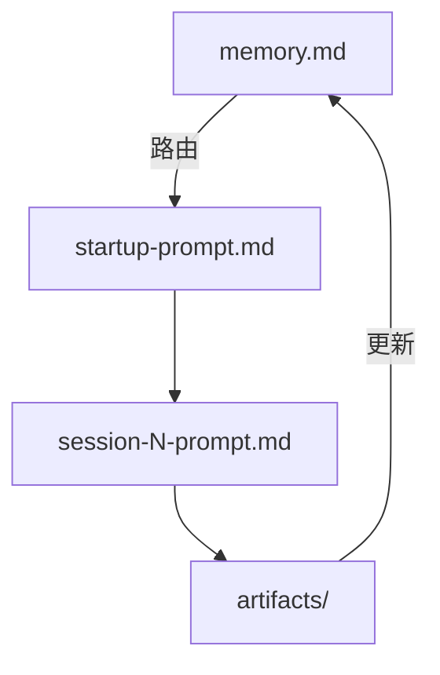

# 文档构建配置 / Doc Build Config

本文件定义在此仓库（及其生成的项目）中撰写和输出文档时的质量标准与风格要求。
Claude 在生成任何文档类文件时应优先遵守本文件中的规则。

---

## 图表规范

### 按场景选择最佳方案

图表技术选型取决于**文件类型**，不是一刀切：

| 场景 | 最佳方案 | 原因 |
|------|----------|------|
| `.html` 展示页（如 `index.html`） | **SVG 内联** | 精确布局、颜色、箭头，视觉效果最强 |
| `docs/*.md` 或任意 `.md` 中的流程图 | **Mermaid.js** | 文本语法、GitHub 原生渲染、好维护 |
| `session-N-prompt.md` 等简单示意 | **ASCII art** | 够用，不引入额外依赖 |

---

### SVG 内联图（HTML 展示页专用）

适用场景：`index.html`、汇报页、landing page

- 精确控制节点位置、箭头方向、颜色编码
- 可加图例（legend），每张图下方必须附 legend
- 支持 `viewBox` 自适应宽度，移动端清晰
- 每种箭头颜色配独立 `<marker>` id，避免混用

---

### Mermaid.js（Markdown 文档专用）

适用场景：`docs/*.md`、`design.md`、`work-plan.md` 等需要嵌入图的 Markdown 文件

````markdown

````

优势：
- GitHub 原生渲染，无需额外工具
- 文本语法，我生成快、你好维护、git diff 清晰
- 自动布局，不用手写坐标
- 支持 `graph TD/LR`、`sequenceDiagram`、`classDiagram` 等多种图类型

---

### ASCII art（简单示意专用）

适用场景：`session-N-prompt.md`、注释、临时说明

仅用于无需精确表达依赖关系的简单示意，不替代 SVG 或 Mermaid。

### 颜色编码约定（与 index.html 保持一致）

| 颜色 | 含义 |
|------|------|
| `#0f766e`（绿） | 核心控制流 / 执行路径 |
| `#d97706`（橙） | 状态读写（memory.md 相关） |
| `#94a3a0`（灰） | 读取 / 参考关系 |
| `#6366f1`（紫） | IDE / VS Code UI 集成 |
| `#fbbf24`（黄） | 目录 / 脚本 |
| `#6ee7b7`（亮绿） | 脚本 / 机器输出（深色背景用） |
| `#a5f3fc`（浅蓝） | 模板文件 |

### marker（箭头）规范

每种颜色配一个独立的 `<marker>` id，避免箭头颜色混用：

```html
<defs>
  <marker id="arr"        ...><polygon fill="#0f766e"/></marker>  <!-- 绿：主流程 -->
  <marker id="arr-orange" ...><polygon fill="#c2410c"/></marker>  <!-- 橙：状态更新 -->
  <marker id="arr-gray"   ...><polygon fill="#94a3a0"/></marker>  <!-- 灰：读取 -->
  <marker id="arr-purple" ...><polygon fill="#6366f1"/></marker>  <!-- 紫：IDE -->
</defs>
```

---

## HTML 文档规范

### 整体风格

- 背景：暖米色系（`#f4efe6` 系列），不用纯白
- 卡片：毛玻璃效果（`backdrop-filter: blur(10px)` + 半透明背景）
- 圆角：卡片 `24px`，内部元素 `16–18px`
- 字体：serif 标题（Palatino/Georgia 系列）+ sans-serif 正文（PingFang SC 系列）+ monospace 代码
- 阴影：`0 24px 70px rgba(39,44,38,0.12)`
- 动画：页面加载时 `rise` 淡入上移

### 层级结构

- `.hero`：项目标题 + 一句话描述 + 最新状态 callout
- `.section`：各功能模块，`padding: 28px`
- `.grid`：两列布局（`1.2fr 0.8fr`），超窄屏折叠为单列
- `.callout`：重要提示，左侧绿色 border，浅绿背景
- `.footer`：深色背景（`#1e2926`），放固定结语

### 深色代码块

```css
pre {
  background: #1d2725;
  color: #eef7f2;
  border-radius: 18px;
  font-size: 14px;
}
```

---

## Markdown 文档规范

- 所有工作流控制文件（`task.md` / `CLAUDE.md` / `PRD.md` / `design.md` / `work-plan.md` / `memory.md` / `session-N-prompt.md`）**一律用 Markdown**，不用 HTML
- Markdown 中的流程图优先用 **Mermaid.js**，简单示意用 ASCII art
- 表格用标准 GFM 语法
- 代码块标注语言（` ```bash ` / ` ```json ` / ` ```mermaid ` 等）

---

## 图例（Legend）规范

每张 SVG 图下方必须附 legend，格式：

```html
<div class="legend">
  <div class="legend-item"><div class="legend-dot" style="background:#0f766e;"></div> 核心执行路径</div>
  <div class="legend-item"><div class="legend-dot" style="background:#d97706;"></div> 状态更新路径</div>
  ...
</div>
```

---

## 分层标注规范

SVG 图中多层结构要用深色标签条标注层名，示例：

```html
<rect x="8" y="8" width="120" height="24" rx="6" fill="#1d2725"/>
<text ... fill="#6ee7b7" font-weight="600">业务定义层</text>
```

层名建议：业务定义层 / 状态路由层 / 执行规格层 / 证据输出层 / 调度层 / 执行层

---

## 文件用途速查

| 场景 | 格式 |
|------|------|
| workflow 控制文件（task / memory / session prompt 等） | `.md` |
| 可视化总览 / 汇报页 / landing page | `.html`（SVG 内联图） |
| `.html` 页中的架构图 / 流程图 / 文件关系图 | **SVG 内联** |
| `.md` 文件中的流程图 / 依赖图 | **Mermaid.js** |
| 简单示意（prompt 内、注释内） | ASCII art |
| 代码示例 | Markdown 代码块 或 HTML `<pre>` |
