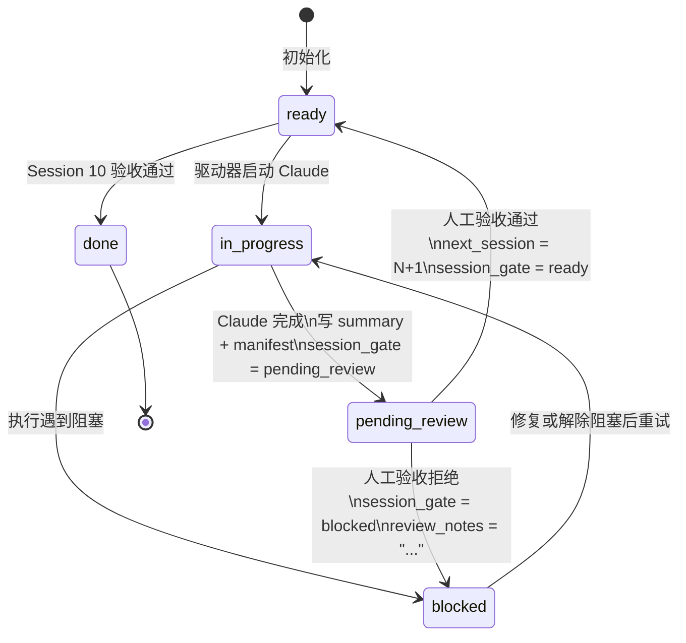
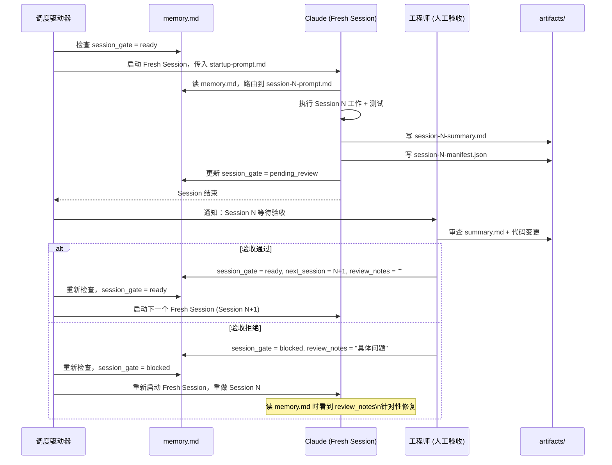

# Human-in-the-Loop (HITL) Review Gate

> 设计日期：2026-03-14
> 更新日期：2026-03-15（方案C已通过 VSCode Dashboard 实现）
> 适用版本：所有使用自动化调度驱动器的场景

---

## 一、设计背景

### 问题

纯自动调度（Claude 执行完 Session N → 驱动器自动推进到 Session N+1）存在根本性风险：

```
Session 3 代码有逻辑 bug
  → Claude 认为测试通过，自动写 manifest，更新 memory.md
  → 调度程序自动触发 Session 4、5、6...
  → Session 10 完成时才发现 Session 3 的基础有问题
  → 7 个 Session 的工作全部建立在错误上，需要全部推倒
```

**错误发现越晚，修复成本指数级增长。**

### 解决方案

在每个 Session 完成后，插入**人工验收门控（HITL Review Gate）**：

```
Claude 执行完 Session → session_gate = pending_review
  → 调度程序暂停
  → 你审核 summary + 代码
  → 批准 → 驱动器推进下一个 Session
  → 拒绝 + 留意见 → 驱动器重做本 Session
```

这是 AI 自动化流水线的行业标准设计（Human-in-the-Loop），与 GitHub PR Review、金融风控审核、医疗 AI 人工复核是同一模式。

---

## 二、状态机扩展

### 新增状态：`pending_review`

| `session_gate` 值 | 含义 | 下一步 |
|-------------------|------|--------|
| `ready` | 可以开始下一个 Session | 驱动器启动 Claude |
| `in_progress` | Session 正在执行 | 等待 Claude 完成 |
| `pending_review` | **Claude 完成，等待人工验收** | 暂停，通知工程师 |
| `blocked` | 验收拒绝 或 执行遇到阻塞 | 重做本 Session |
| `done` | 整个工作流完成 | 结束 |

### 状态转换图



---

## 三、memory.md 字段说明

### 新增字段

```markdown
## Session Status
- current_phase: development
- last_completed_session: 3
- last_completed_session_tests: passed
- next_session: 4
- next_session_prompt: `session-4-prompt.md`
- session_gate: pending_review        ← Claude 执行完后设为此值
- review_notes: ""                    ← 验收拒绝时填写原因，传给下一轮 Claude
```

### 字段使用规则

**Claude 执行完 Session 后必须设置：**
```
session_gate: pending_review
```

**驱动器在此状态下必须：**
- 暂停，不得自动推进
- 通知工程师验收

**工程师验收通过后操作：**
```
session_gate: ready
next_session: N+1
review_notes: ""
```

**工程师验收拒绝后操作：**
```
session_gate: blocked
review_notes: "具体问题描述，告诉 Claude 下次重做要注意什么"
（next_session 保持不变，Claude 重做同一个 Session）
```

---

## 四、`review_notes` 的作用

`review_notes` 是工程师与下一轮 Claude 之间的通信渠道：

```
工程师写：
  review_notes: "数据加载逻辑错误：应该在 useEffect 内部调用，
                 不能在组件顶层直接调用。另外 loading 状态没有处理。"

下一轮 Claude 读 memory.md 时看到 review_notes：
  → 知道上一轮被拒绝
  → 知道具体原因
  → 针对性修复，不会犯同样的错误
```

没有 `review_notes`：Claude 重做时不知道为什么失败，可能犯同样的错误。

---

## 五、三种实现方案

### 方案 A：终端交互确认（推荐起步，1 天可实现）**流程：**
```
Claude 执行完毕，设 session_gate = pending_review
驱动器检测到 pending_review：
  → 打印提示：
      === Session 3 已完成，请验收 ===
      摘要：artifacts/session-3-summary.md
      清单：artifacts/session-3-manifest.json
  → 等待输入：[y=通过 / n=拒绝 / q=暂停退出]

y → 驱动器自动更新 memory.md (ready, next_session=4) → 启动 Session 4
n → 提示输入拒绝原因 → 驱动器更新 memory.md (blocked, review_notes) → 重启 Session 3
q → 保存状态，退出。下次运行驱动器时从 pending_review 状态继续
```

**适用：** 你一直在电脑旁边，实时响应

---

### 方案 B：信号文件异步等待（推荐生产，2 天可实现）

**流程：**
```
Claude 执行完毕，设 session_gate = pending_review
驱动器：
  → 写入 artifacts/session-3-pending-review      （挂起标志）
  → 发送系统通知 / 终端 bell
  → 进入等待循环，每 30 秒轮询信号文件

你在方便的时候验收：
  → 查看 artifacts/session-3-summary.md
  → 满意：touch artifacts/session-3-approved
  → 不满意：echo "问题说明" > artifacts/session-3-rejected

驱动器检测到信号文件：
  → approved → 清理信号文件 → 更新 memory.md (ready) → 推进
  → rejected → 读取拒绝原因 → 更新 memory.md (blocked + review_notes) → 重做
```

**优势：** 你可以做别的事，不需要守在终端旁边

---

### 方案 C：VSCode Dashboard 内嵌验收界面（✅ 已实现）

**已于 2026-03-15 通过 VSCode 扩展实现，无需额外开发。**

**使用方式：**
```
Claude 执行完毕，session_gate = pending_review
  → Dashboard 顶栏变为 "Gate: 待验收" pill
  → 页面展示琥珀色 Banner：
      ⏸ 等待人工验收 — Session 已完成
      [ ✅ 批准，推进下一 Session ]  [ ❌ 驳回 ]

点击批准 → 自动写 memory.md (session_gate = ready) → 刷新 Dashboard
点击驳回 → 弹出输入框填写原因 → 自动写 memory.md (blocked + review_notes)

blocked 状态下：
  → 展示红色 Banner：
      ⛔ Session 已驳回
      [ 🔄 重新开放本 Session ]
  → 修复后点击重新开放 → session_gate = ready → 重做
```

**技术实现：**
- `vibeCoding.approveSession`：正则替换 `memory.md` 中 `session_gate` 为 `ready`
- `vibeCoding.rejectSession`：替换 `session_gate` 为 `blocked`，插入或更新 `review_notes`
- `session_gate` 直接从 `memory.md` 读取（`workflowDetector.ts`），无需 driver 调用，Dashboard 打开即显示

---

## 六、完整执行时序



---

## 七、与现有架构的关系

HITL Review Gate 是现有 External Driver Pattern 的**增量扩展**，不破坏任何现有逻辑：

| 原有机制 | 变化 |
|---------|------|
| `session_gate` 状态枚举 | 新增 `pending_review` 值 |
| `memory.md` 字段 | 新增 `review_notes` 字段（可选，默认空） |
| `run-vibecoding-loop.py` | 新增对 `pending_review` 状态的处理逻辑 |
| Claude 执行完后的更新规则 | `session_gate` 由 `passed` → `pending_review` |
| 驱动器推进逻辑 | 原来检查 `ready`，现在还需处理 `pending_review` 等待 |

所有现有文档、模板、工具均向后兼容。

---

## 八、为什么不全自动？

全自动（跳过人工验收）存在**不可接受的累积错误风险**：

```
Session 3 有隐性 bug（业务逻辑错误，不是编译错误）
  → 测试可能仍然通过（测试覆盖不全）
  → Claude 认为完成，自动推进
  → Session 4-10 全部建立在错误基础上
  → 发现时已是第 10 个 Session，修复成本 = 重做 Session 3-10
```

**人工验收解决的不是"测试有没有通过"，而是"业务逻辑是否正确"。**

这两者无法被自动化替代，除非你有 100% 覆盖率的业务语义测试（现实中不存在）。

---

## 九、何时可以跳过 HITL？

以下场景可考虑弱化（但不完全跳过）HITL：

| 场景 | 建议 | 原因 |
|------|------|------|
| Session 输出是纯配置文件 | 可缩短验收时间 | 风险低，容易验证 |
| Session 有高覆盖率自动化测试 | 可设置"无人值守快速确认" | 测试可代替部分人工判断 |
| Session 0（设计阶段） | **建议严格验收** | 设计错误影响全部后续 Session |
| Session 1-3（核心架构） | **必须严格验收** | 后续 Session 全部依赖 |
| Session 8-10（收尾功能） | 可适当放宽 | 基础已稳定 |

**原则：越早的 Session，验收越严格。**

---

## 十、实施路线图

| 阶段 | 目标 | 工作量 |
|------|------|--------|
| **立即可用** | 方案 A：驱动器加终端交互确认 | 1 天 |
| **生产推荐** | 方案 B：信号文件异步等待 + 系统通知 | 2 天 |
| **✅ 已实现** | 方案 C：VSCode Dashboard 内嵌验收按钮（批准/驳回/重新开放）| 完成 |

详见 [docs/optimization-roadmap.md](optimization-roadmap.md)。
