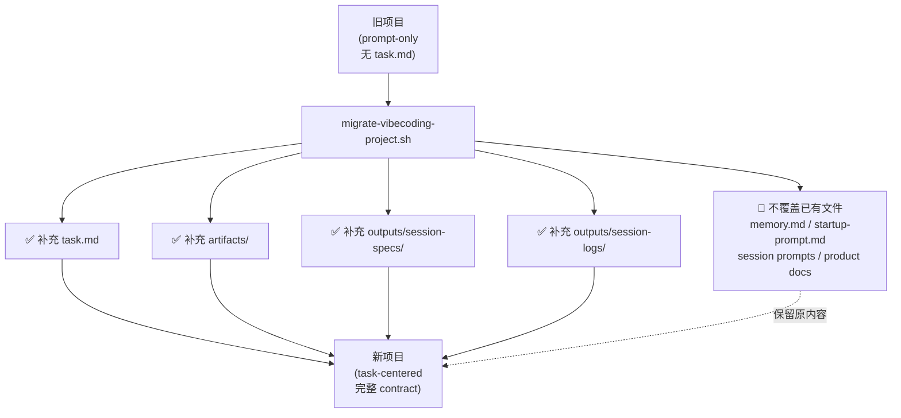
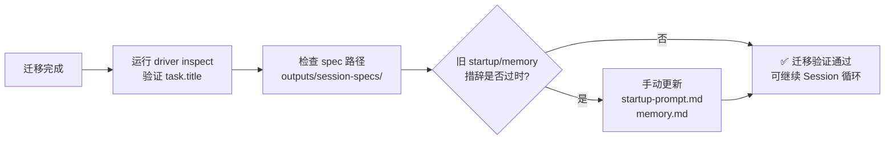

# Legacy Project Migration

The current workflow contract is intentionally strict:

- `task.md` is required
- `artifacts/session-N-summary.md` is the session handoff evidence
- `outputs/session-specs/session-N-spec.json` is the machine-readable fresh-session handoff

This is a breaking change for older workflow projects that were created before
`task.md` and session summaries became first-class.

## Recommended Strategy

Use explicit migration, not runtime fallback.

Why:

- keeps one routing model instead of two
- prevents silent drift between legacy and current projects
- lets the driver stay strict and machine-checkable
- avoids guessing task-level intent from prompt files



## Migration Command

From this repository root:

```bash
./scripts/migrate-vibecoding-project.sh /path/to/legacy-project
```

Optional:

```bash
./scripts/migrate-vibecoding-project.sh /path/to/legacy-project --title "Task Title"
```

## What The Migration Script Does

Non-destructively adds missing assets only:

- `task.md`
- `artifacts/`
- `artifacts/session-summary-template.md`
- `outputs/session-specs/`
- `outputs/session-logs/`

It does not overwrite existing `startup-prompt.md`, `memory.md`, session prompts,
or product docs.

## Post-Migration Review

After migration:

1. run the driver in inspect mode
2. verify `task.title` and generated spec paths
3. review older `startup-prompt.md`, `memory.md`, and session prompts if the project still follows the pre-task wording

Recommended verification:

```bash
python3 ./scripts/run-vibecoding-loop.py /path/to/legacy-project --action inspect --json
```



## Why No Fallback

The driver intentionally does not treat missing `task.md` as optional.
If fallback were added, the repository would again have:

- a task-centered path
- a prompt-only legacy path

That would weaken the contract the rest of the documentation now depends on.
