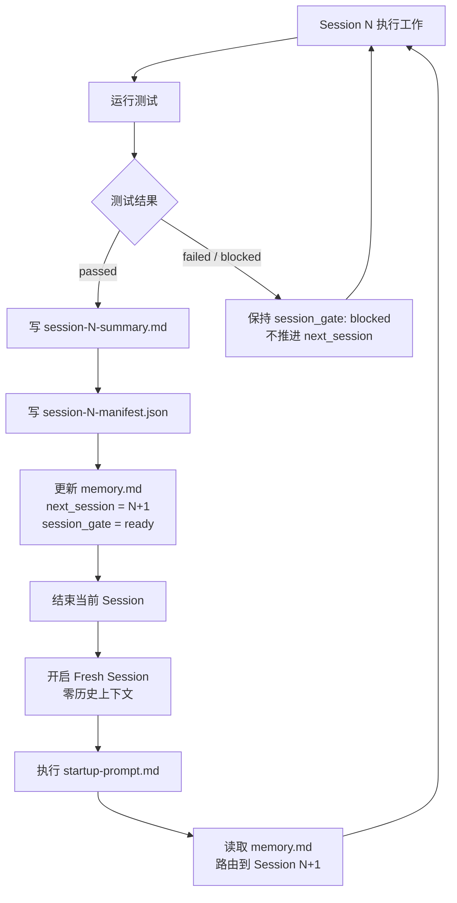
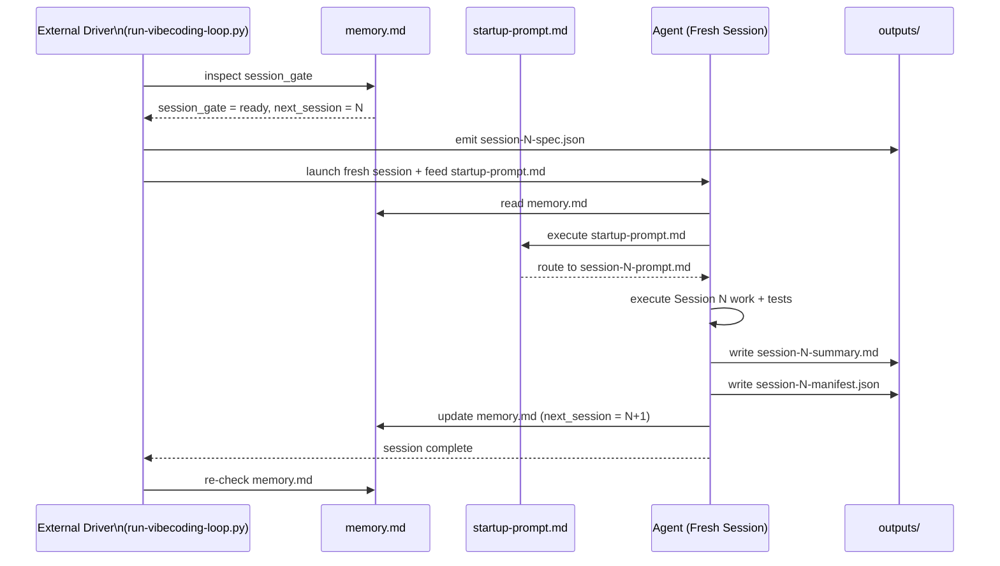
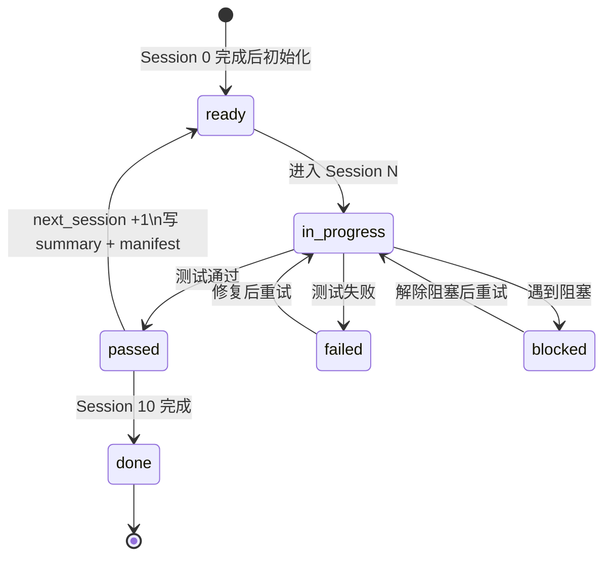

# Progress Loop

## Why This Exists

Multi-session development fails when the next step depends on chat memory instead of files.
This workflow avoids that by using a fixed loop:

1. finish one session
2. write `artifacts/session-N-summary.md`
3. record progress in `memory.md`
4. end the current session
5. start a fresh session / fresh context
6. re-enter through `startup-prompt.md`
7. continue from the session selected by `memory.md`

This loop now has two handoff layers:

- `memory.md`: machine routing truth
- `artifacts/session-N-summary.md`: human/model handoff evidence (human-readable)
- `artifacts/session-N-manifest.json`: machine-verifiable session completion record



## What Must Be Recorded Every Session

At minimum, write these back into `memory.md`:

- `last_completed_session`
- `last_completed_session_tests`
- `next_session`
- `next_session_prompt`
- `session_gate`

Also record a short progress note:

- what this session completed
- what tests were run
- whether tests passed, failed, or were blocked
- what the next session needs to read

And persist a session summary file:

- `artifacts/session-N-summary.md`
- completed work
- changed files
- tests
- decisions
- risks
- next session inputs

And persist a session manifest file:

- `artifacts/session-N-manifest.json`
- session number and status
- produced artifacts list
- next session requirements
- test status

## Why Startup Must Run Every Time

After a session ends, the model should not guess which session comes next.
`startup-prompt.md` exists to:

- read `memory.md`
- read `task.md`
- read the previous session summary when it exists
- validate `session_gate`
- route to the correct `session-N-prompt.md`
- block unsafe forward movement

## Required Loop

- do not jump directly into `session-2-prompt.md` or later
- do not continue based on previous chat memory
- do not push `next_session` forward if tests failed
- do not skip writing `artifacts/session-N-summary.md`
- do not skip writing `artifacts/session-N-manifest.json`
- do not end a session before updating `memory.md`
- do not treat "auto-continue inside the same chat" as the preferred mode

## Preferred Restart Strategy

The preferred execution mode is:

- one completed deliverable per session
- then terminate that session
- then open a fresh session
- then run `startup-prompt.md` again

Why:

- cleaner context boundaries
- lower risk of hidden prompt carry-over
- easier automation outside the chat window
- safer gating on `memory.md`

## Automation Shape

The preferred automation shape is an external session driver, not in-chat self continuation.

Example responsibilities:

- inspect `memory.md`
- confirm `session_gate = ready`
- resolve the previous session summary
- emit `outputs/session-specs/session-N-spec.json`
- launch one fresh session
- feed `startup-prompt.md`
- wait for session completion
- re-check `memory.md`



## Correct Sequence

```text
Session N work
-> tests
-> write session-N-summary.md
-> write session-N-manifest.json
-> update memory.md
-> end current session
-> start fresh session
-> run startup-prompt.md
-> startup reads memory.md
-> startup reads previous summary
-> Session N+1 or stay on Session N
```

## Blocked and Failed Sessions

If the session is blocked or failed:

- keep `next_session` on the current session
- set `last_completed_session_tests` to `blocked` or `failed`
- set `session_gate` to `blocked`
- explain the blocker in `memory.md`



## Completed Sessions

If the session is complete:

- set `last_completed_session_tests: passed`
- move `next_session` forward
- set `session_gate: ready`
- describe the handoff inputs for the next session
