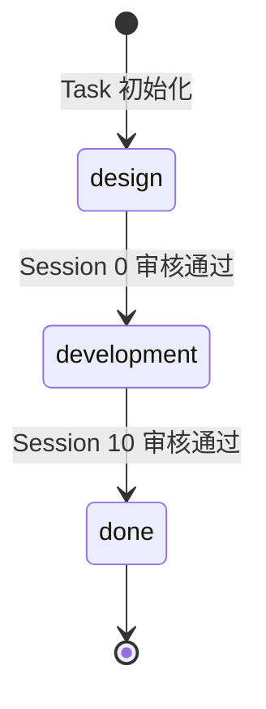
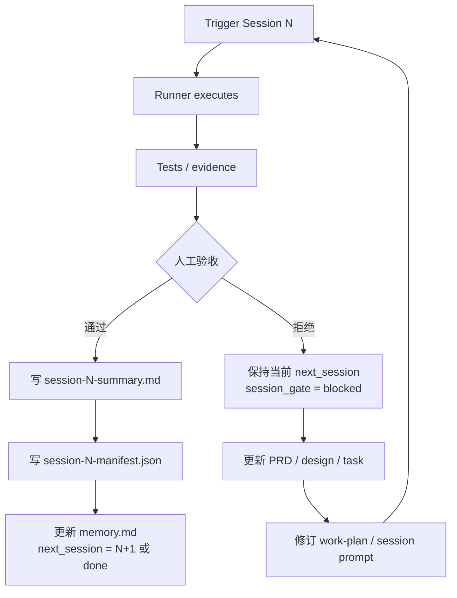

# Progress Loop

> 2026-03-17 设计更新：Progress loop 以“LangGraph 常驻 + 单 session 显式触发 + 人工验收后推进”为准。

## Two-Phase Structure

| Phase | current_phase | Sessions | 目标 |
|-------|--------------|----------|------|
| 设计阶段 | `design` | Session 0 | 产出初始规划文档、`work-plan.md`、初始 Session prompts |
| 开发阶段 | `development` | Session 1–10 | 按 Session 逐步实现功能，每次执行后进入人工验收 |
| 完成 | `done` | — | 流程全部结束 |

### Phase Transition Rules

- `design -> development`: Session 0 审核通过，`next_session: 1`
- `development -> done`: Session 10 审核通过，`session_gate: done`
- 任意 Session 驳回：不推进 `next_session`
- 驳回后允许更新 `PRD.md`、`design.md`、`task.md`、`work-plan.md` 和当前/后续 prompt

## Why This Exists

Multi-session development fails when the next step depends on chat memory instead of files.  
This workflow avoids that by using a fixed loop:

1. trigger one current session
2. run one deliverable attempt
3. collect tests and candidate artifacts
4. wait for human review
5. approve -> write summary / manifest / `memory.md`
6. reject -> keep same `next_session`, revise docs and plan, then re-run

This loop has two handoff layers:

- `memory.md`: machine routing truth
- `artifacts/session-N-summary.md`: human/model handoff evidence
- `artifacts/session-N-manifest.json`: machine-verifiable completion record

## What Must Be Recorded For An Accepted Session

At minimum, write these back into `memory.md`:

- `last_completed_session`
- `last_completed_session_tests`
- `next_session`
- `next_session_prompt`
- `session_gate`

Persist accepted artifacts:

- `artifacts/session-N-summary.md`
- `artifacts/session-N-manifest.json`

Record:

- completed work
- changed files
- tests that were run
- decisions
- risks
- next session inputs

## Why Startup Must Run Every Time

After a session ends, the model should not guess which session comes next.  
`startup-prompt.md` exists to:

- read `memory.md`
- read `task.md`
- read the previous session summary when it exists
- validate `session_gate`
- route to the correct `session-N-prompt.md`
- block unsafe forward movement

## Required Loop

- do not jump directly into a stale `session-N-prompt.md`
- do not continue based on previous chat memory
- do not push `next_session` forward before customer acceptance
- do not skip writing `artifacts/session-N-summary.md` for an accepted session
- do not skip writing `artifacts/session-N-manifest.json` for an accepted session
- do not treat runner success as workflow success
