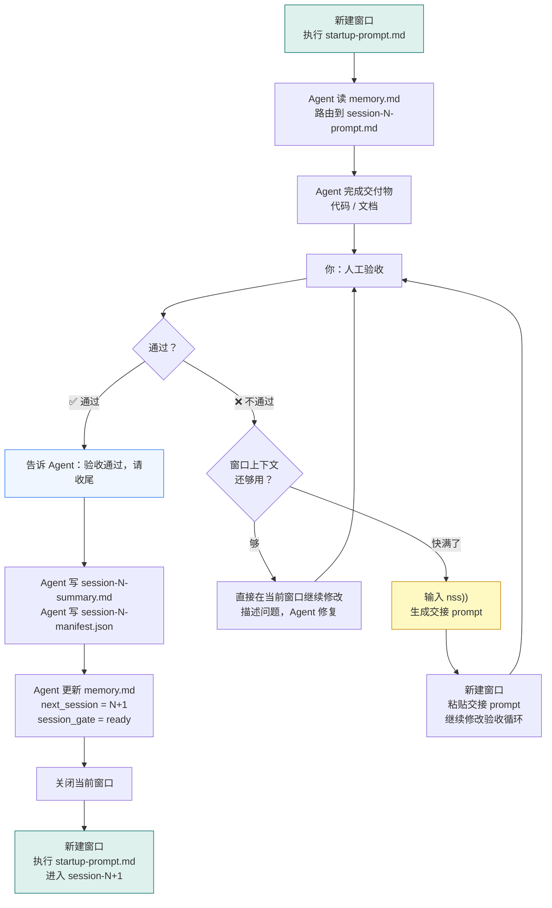
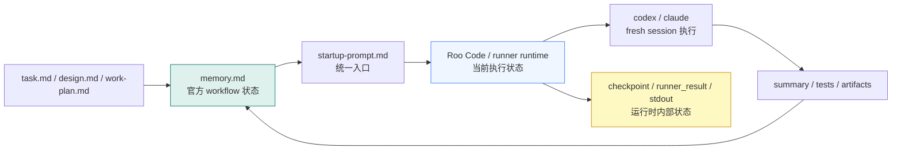
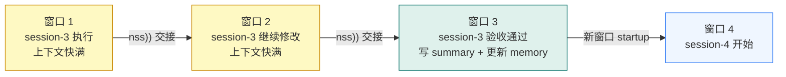
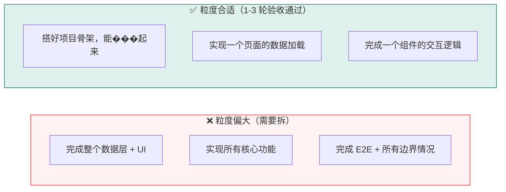
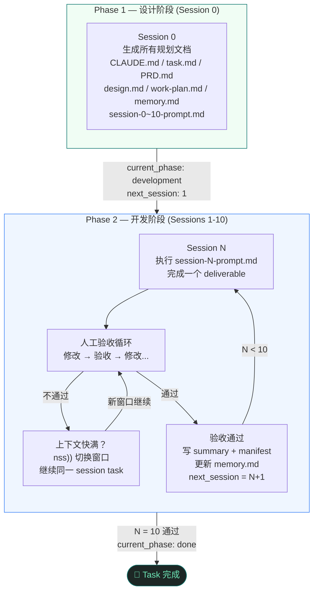

# 真实 VibeCoding 开发指导

> 本文描述的是**实际开发节奏**，而非理想模型。
> 核心差异：每个 session task 几乎不可能一次跑完，人工验收 → 修改 → 再验收是常态。

---

## 理想模型 vs 真实模式

| | 理想模型（文档描述） | 真实模式 |
|--|--|--|
| session task 执行 | 一次跑完，测试通过 | 多轮验收修改后通过 |
| 窗口数量 | 每个 session 一个窗口 | 一个 session task 可能跨多个窗口 |
| memory.md 推进 | session 结束即推进 | 验收通过后才推进 |
| 上下文管理 | 不涉及 | 用 `nss))` 切换窗口 |

两种模式都合法，workflow 本身支持真实模式，只是文档没有把它说清楚。

---

## 一个 session task 的完整生命周期



---

## 关键规则（只有这几条真正重要）

### 1. memory.md 是唯一状态源

```
验收未通过 → session_gate 保持 blocked，next_session 不动
验收通过   → next_session = N+1，session_gate = ready
```

如果使用 Roo Code / driver / Codex，这条规则也不变。调度器只负责”跑”，不负责替代 `memory.md` 成为业务真相。



可以这样理解：

- `memory.md` 决定“官方做到哪一轮”
- runtime 决定“这次执行跑到哪里”
- 只有写完 summary、tests、artifacts，并更新 `memory.md`，这次执行结果才算正式生效

### 2. 同一个 session task 可以跨多个窗口

这不违反 workflow。只要 `memory.md` 的 `next_session` 没有推进，新窗口依然在同一个 session task 里工作。



### 3. 每个 session task 通过后必须写 summary

不写 summary → 下一个窗口的 Agent 没有上下文 → 重复犯同样的错误。

### 4. 新窗口必须从 startup-prompt.md 进入

不要直接粘贴 `session-N-prompt.md` 的内容。`startup-prompt.md` 会读 `memory.md`，自动路由到正确的 session。

---

## 实操手册

### 开始一个新 session task

```
新建 Claude Code 窗口
→ 粘贴：工作目录切到 <你的项目目录>，请执行 startup-prompt.md 中的启动流程
→ Agent 自动读 memory.md，路由到当前 session task
```

### 验收不通过，当前窗口继续

```
直接说：这里有问题，[描述问题]，请修改
→ 继续在当前窗口迭代，不需要任何仪式
```

### 窗口上下文快满，需要切换

```
输入：nss))
→ 复制生成的交接 prompt
→ 新建窗口粘贴
→ 继续验收修改循环
→ 注意：此时 memory.md 的 next_session 还没推进，新窗口继续同一个 session task
```

### session task 验收通过，收尾

```
告诉 Agent：验收通过，请完成本 session 的收尾工作
→ Agent 写 artifacts/session-N-summary.md
→ Agent 写 artifacts/session-N-manifest.json
→ Agent 更新 memory.md（next_session = N+1，session_gate = ready）
→ 关闭窗口
→ 新窗口从 startup-prompt.md 进入下一个 session task
```

---

## session task 粒度建议

如果一个 session task 验收了 5 轮以上还没过，通常意味着 deliverable 定义太模糊或范围太大。



粒度偏大时，在 `work-plan.md` 里把它拆成两个 session task，不要强行在一个 session 里完成。

---

## 完整节奏总览



---

## 一句话总结

> 同一个 session task 可以跨多个窗口反复修改验收，`nss))` 负责窗口切换，`memory.md` 的 `next_session` 只在验收通过后才推进。
