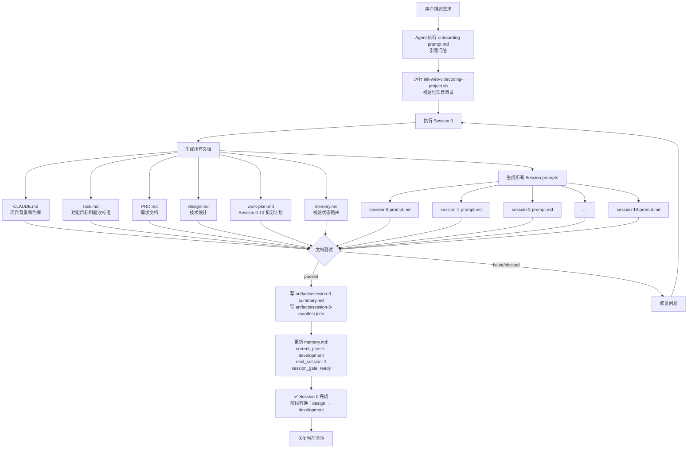
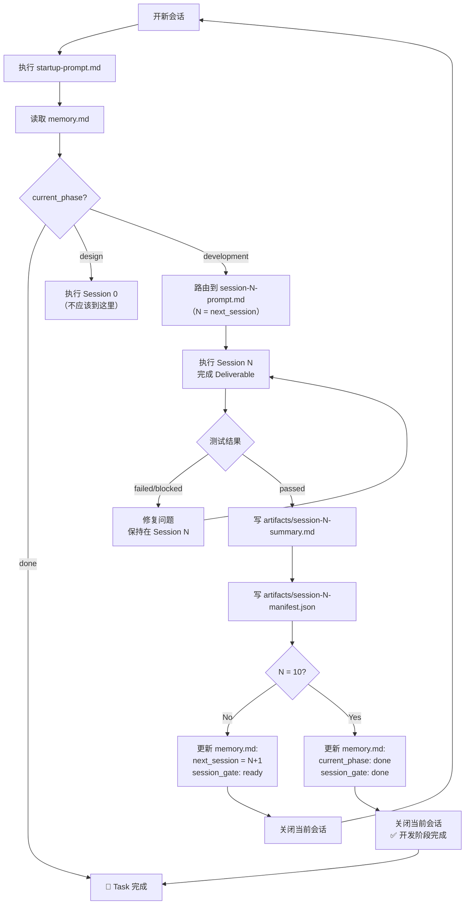
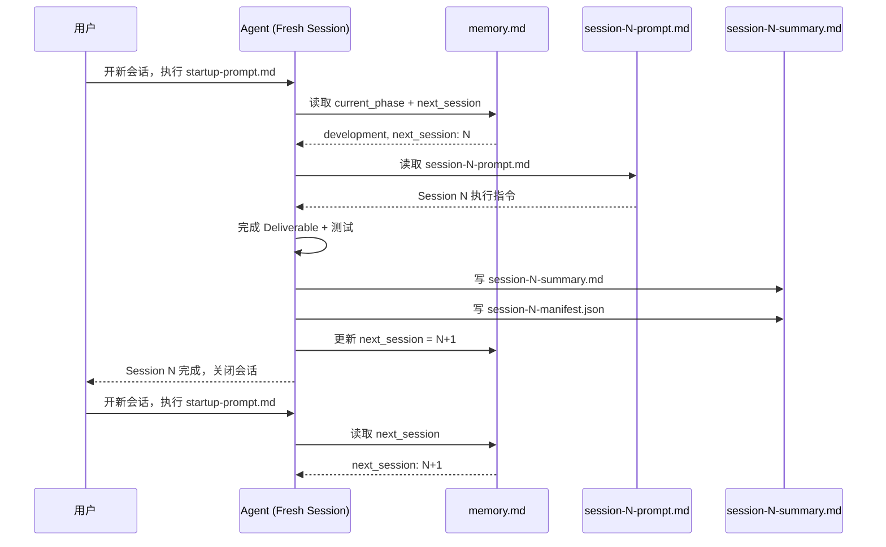

# Session Map

This map describes the recommended session split for one task.
Use one `startup-prompt.md` and one `memory.md` per task, then let multiple
sessions advance that task one deliverable at a time.

Each session must produce exactly one testable deliverable and pass its test gate
before the next session may begin.

## Before You Start

If you have not created `CLAUDE.md` and `task.md` yet, run the onboarding flow first:

```
请读取 vibecodingworkflow/templates/onboarding-prompt.md，
然后按照其中的步骤引导我开始开发。
```

This will guide you through background collection and feature alignment before generating the scaffold.
See [`templates/onboarding-prompt.md`](../templates/onboarding-prompt.md) and [`docs/user-guide.md`](user-guide.md) for details.

---

## How to Use This Map

Before Session 0, complete the two required alignment steps:

1. **Align project background** with your Agent — system purpose, users, domain constraints
   → becomes `CLAUDE.md` (project-level, shared across all tasks)
2. **Align feature requirements** with your Agent — scope, boundaries, acceptance criteria
   → becomes `task.md` + `PRD.md` (task-level, one per feature)

Then trigger Session 0 to generate all planning documents.

---

## 两阶段完整流程详解

### Phase 1 — 设计阶段（Session 0）

**目标**：产出全部规划文档和 Session prompts，不写业务代码

**流程**：



**关键产出**：
- 6 个核心文档（CLAUDE.md, task.md, PRD.md, design.md, work-plan.md, memory.md）
- 11 个 Session prompts（session-0-prompt.md 到 session-10-prompt.md）
- Session 0 handoff artifacts（summary + manifest）

**阶段转换条件**：
- `tests: passed` → `current_phase: development`, `next_session: 1`

---

### Phase 2 — 开发阶段（Sessions 1-10）

**目标**：逐个执行 Session prompts，每个 Session 完成一个可测试交付物

**流程**：



**每个 Session 的执行模式**：



**关键规则**：
1. **Session prompts 在 Session 0 就全部生成好了**，开发阶段只是逐个执行
2. **每个 Session 在独立的 fresh context 中执行**，不依赖聊天历史
3. **每个 Session 完成后必须关闭会话**，下一个 Session 在新会话中启动
4. **`memory.md` 是唯一路由真相**，决定该执行哪个 Session
5. **不是批量执行**，而是：执行 → 测试 → 更新 → 停止 → 开新会话 → 执行下一个

---

## Phase 1 — 设计阶段（Design Phase）

`current_phase: design` | 只含 Session 0 | 产出全部规划文档，不写业务代码

| Session | Focus | Deliverable | Test Gate |
|---------|-------|-------------|-----------|
| 0 | Planning | `CLAUDE.md`, `task.md`, `PRD.md`, `design.md`, `work-plan.md`, `memory.md` | Key docs exist, `memory.md` valid |

Session 0 通过后 → `current_phase` 转为 `development`，`next_session: 1`

---

## Phase 2 — 开发阶段（Development Phase）

`current_phase: development` | Sessions 1–10 | 按 Session 逐步实现功能

| Session | Focus | Deliverable | Test Gate |
|---------|-------|-------------|-----------|
| 1 | Scaffold | Project skeleton, routing, minimal entry point | Project starts, structure verifiable |
| 2 | Schema | Page map, data models, interface contracts | Types correct, aligned with PRD |
| 3 | Data | Config, context, data loading layer | Data loading callable, context accessible |
| 4 | Core logic A | First core feature module (UI + API) | Feature interactive, key fields complete |
| 5 | Core logic B | Second core feature module (UI + API) | Feature interactive, modules can interact |
| 6 | Integration | External interfaces, permissions, audit log | Interfaces callable, side effects recorded |
| 7 | Resilience | Error handling, missing data, degraded paths | Error scenarios handled, fallbacks trigger |
| 8 | E2E | End-to-end integration and wiring | Full main flow passes E2E test |
| 9 | Verification | Real-environment validation, edge cases | Business edge cases pass, risks covered |
| 10 | Closeout | Final docs, `session_gate: done` | All docs complete, memory marked done |

Session 10 通过后 → `current_phase` 转为 `done`

---



```mermaid
graph LR
    subgraph DESIGN["Phase 1 — 设计阶段 (design)"]
        S0["0\n📄 规划"]
    end

    subgraph DEV["Phase 2 — 开发阶段 (development)"]
        S1["1\n🏗 骨架"]
        S2["2\n📐 Schema"]
        S3["3\n💾 数据层"]
        S4["4\n⚙️ 逻辑A"]
        S5["5\n⚙️ 逻辑B"]
        S6["6\n🔌 集成"]
        S7["7\n🛡 容错"]
        S8["8\n🔗 E2E"]
        S9["9\n✅ 验证"]
        S10["10\n📦 收尾"]
    end

    END(["🎉 done"])

    S0 -->|"phase→development\ngate✓"| S1
    S1 -->|gate✓| S2 -->|gate✓| S3 -->|gate✓| S4
    S4 -->|gate✓| S5 -->|gate✓| S6 -->|gate✓| S7 -->|gate✓| S8
    S8 -->|gate✓| S9 -->|gate✓| S10 -->|"phase→done"| END

    style S0 fill:#dff1ec,stroke:#0f766e,color:#155e57
    style DESIGN fill:#f0fdf4,stroke:#0f766e
    style DEV fill:#eff6ff,stroke:#3b82f6
    style END fill:#1d2725,color:#6ee7b7,stroke:#0f766e
```

## Rules

- Session 0 produces documents only — no business implementation code
- Phase transition only happens when `tests: passed`
- Each session advances exactly one deliverable
- `session_gate` must be `ready` before the next session starts
- A failed or blocked session keeps `next_session` and `current_phase` unchanged until resolved
- Always re-enter through `startup-prompt.md` — never jump directly to `session-N-prompt.md`
