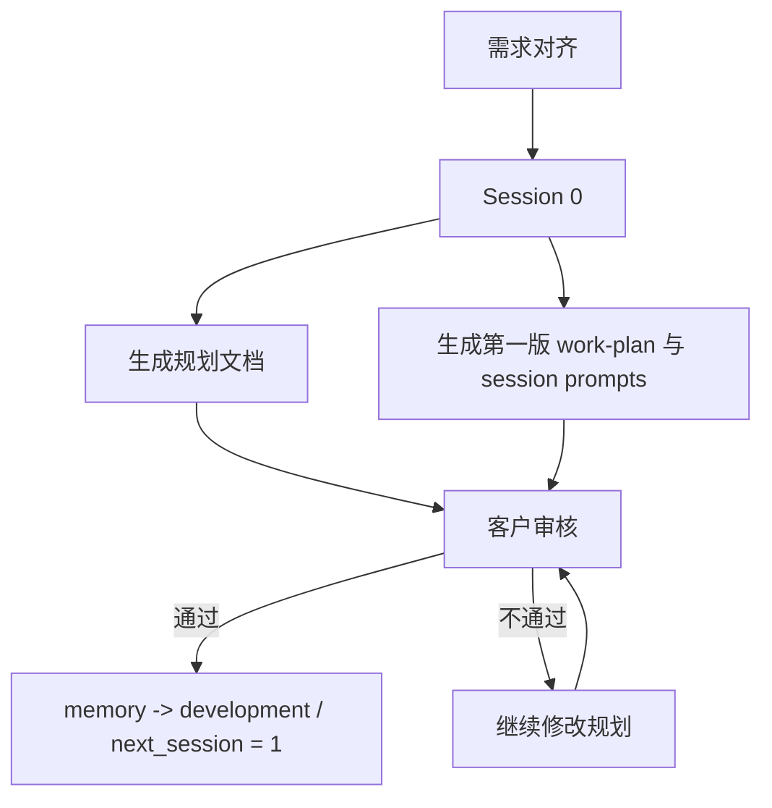
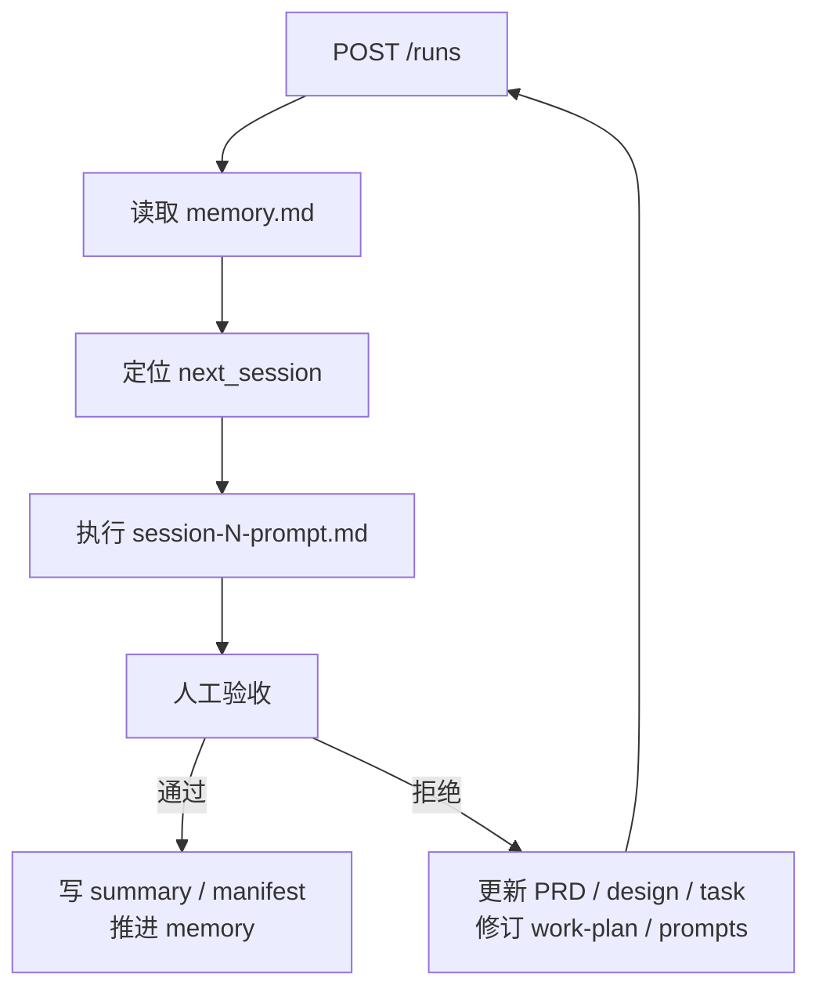
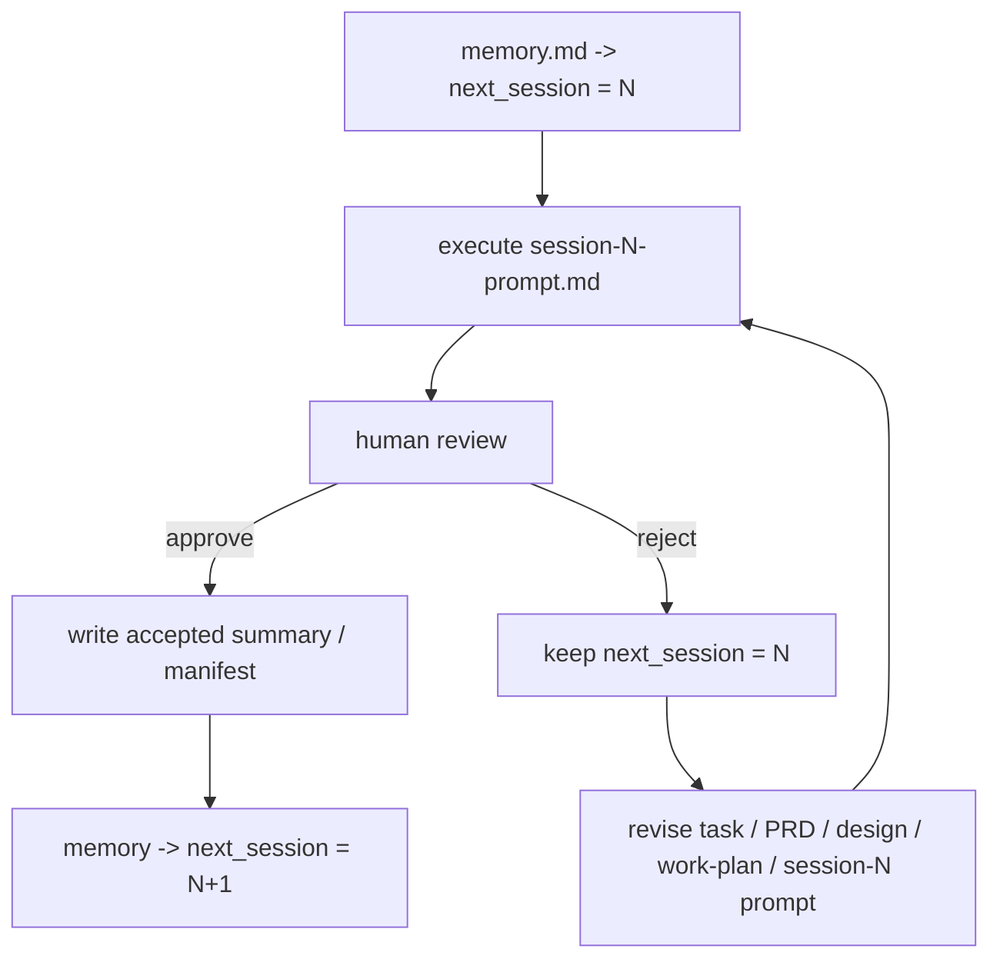

# Session Map

> 2026-03-17 设计更新：本地图同步到“Session 0 生成第一版计划，开发阶段按需修订计划；LangGraph 每次只执行一个 Session attempt，执行后必须人工验收”。

This map describes the recommended session split for one task.  
Use one `startup-prompt.md` and one `memory.md` per task, then let multiple
sessions advance that task one deliverable at a time.

## Before You Start

If you have not created `CLAUDE.md` and `task.md` yet, run the onboarding flow first:

```text
请读取 vibecodingworkflow/templates/onboarding-prompt.md，
然后按照其中的步骤引导我开始开发。
```

See [`templates/onboarding-prompt.md`](../templates/onboarding-prompt.md) and [`docs/user-guide.md`](user-guide.md).

## How To Use This Map

Before Session 0, complete the required alignment:

1. Align project background with your Agent  
   -> becomes `CLAUDE.md`
2. Align feature requirements with your Agent  
   -> becomes `task.md` + `PRD.md`

Then trigger Session 0 to generate the first planning set.

## Two-Phase Flow

### Phase 1 — 设计阶段（Session 0）

目标：

- 产出 `CLAUDE.md`、`task.md`、`PRD.md`、`design.md`
- 产出第一版 `work-plan.md`
- 产出第一版 `session-0-prompt.md` 到 `session-10-prompt.md`
- 初始化 `memory.md`



### Phase 2 — 开发阶段（Sessions 1-10）

目标：

- LangGraph 每次只执行当前 `next_session`
- 每个 Session 完成一个可测试 deliverable
- runner 完成后进入人工验收
- 验收通过才推进到下一轮



## Core Rules

1. Session 0 只负责生成第一版计划，不保证后续永不修改。
2. 开发阶段允许在 reject 后修订 `work-plan.md` 和当前/后续 prompts。
3. LangGraph server 可以常驻，但每次 run 只处理一个 Session attempt。
4. runner 成功不等于 workflow 推进成功。
5. `memory.md` 只在验收通过后推进。

## Recommended Session Split

| Session | Focus | Deliverable | Review Gate |
|---------|-------|-------------|-------------|
| 0 | Planning | `CLAUDE.md`, `task.md`, `PRD.md`, `design.md`, `work-plan.md`, `memory.md`, first prompt set | 文档与计划审核通过 |
| 1 | Scaffold | Project skeleton, routing, minimal entry point | 可以启动，结构可验证 |
| 2 | Schema | Page map, data models, interface contracts | 类型与 PRD/Design 对齐 |
| 3 | Data | Config, context, data loading layer | 数据加载可调用 |
| 4 | Core logic A | First core feature module | 关键交互可运行 |
| 5 | Core logic B | Second core feature module | 模块可联动 |
| 6 | Integration | External interfaces, permissions, audit log | 接口可调用，副作用可追溯 |
| 7 | Resilience | Error handling, degraded paths | 失败路径可验证 |
| 8 | Validation | Test strengthening, regression closure | 核心测试通过 |
| 9 | UX polish | Interaction polish, empty/loading/error states | 主要页面体验达标 |
| 10 | Closeout | Final verification, docs, cleanup | 最终验收通过，workflow done |

## Review And Rework Rule

If customer review rejects the current session:

- keep `next_session` unchanged
- keep work on the same session number
- update `review_notes`
- update `PRD.md` / `design.md` / `task.md` if scope or acceptance changed
- update `work-plan.md` and current/downstream `session-N-prompt.md`
- trigger the same session again

## Session Prompt Acceptance Contract

Each `session-N-prompt.md` is an independent acceptance unit.

- One prompt corresponds to one scoped deliverable, one review gate, and one official advancement decision.
- LangGraph may execute only the prompt pointed to by `memory.md -> next_session` and `next_session_prompt`.
- Approval means the current prompt's deliverable is accepted and the workflow may advance to `session-(N+1)`.
- Rejection means the current prompt is still the active unit of work; the workflow must not advance to `session-(N+1)`.
- After rejection, the team may revise `task.md`, `PRD.md`, `design.md`, `work-plan.md`, and the current/downstream `session-N-prompt.md` files before rerunning the same session number.



## Summary

Use this map as a planning baseline, not as an immutable script.  
The official driver of progression is always `memory.md`, and official advancement
happens only after human acceptance.
