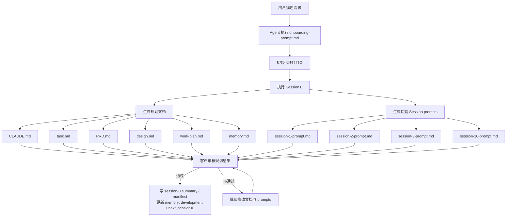
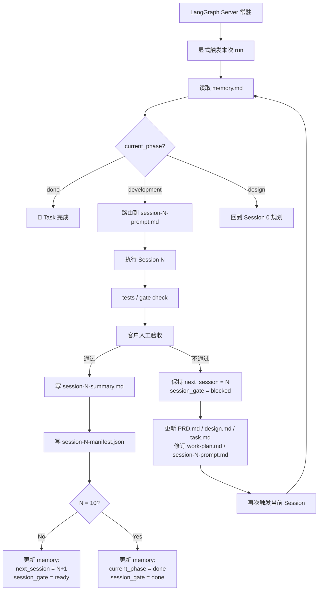
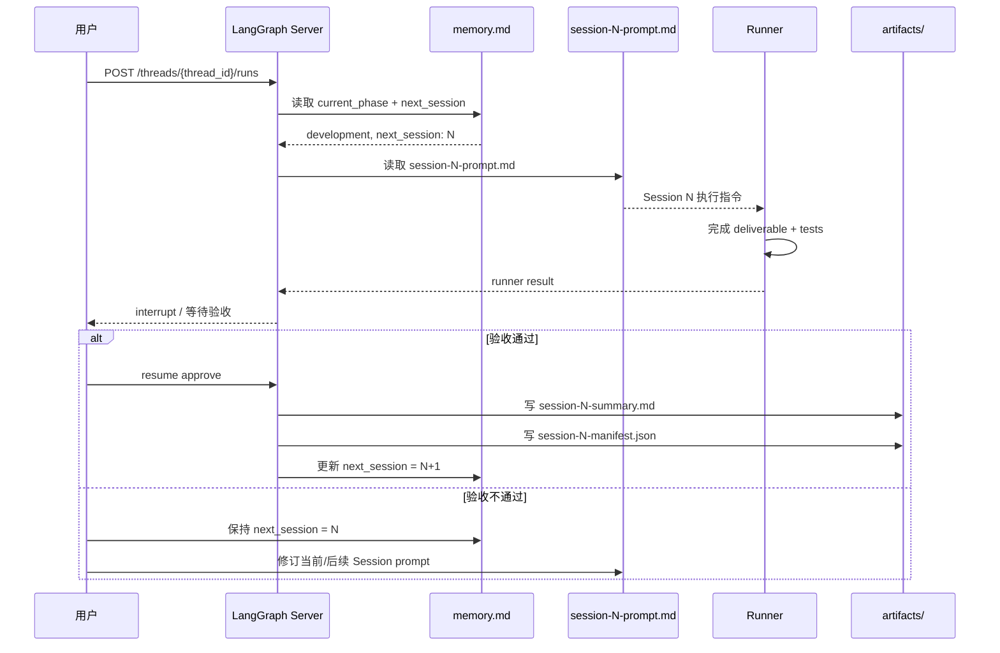

# 两阶段架构详解

> 2026-03-17 设计更新：本文同步到“LangGraph 常驻服务 + 单 session 显式触发 + 人工验收通过后才推进”的目标架构。

## 概述

VibeCoding Workflow 仍然采用两阶段模型，但开发阶段的推进口径改为：

- LangGraph Server 常驻
- 每次 run 只执行当前 `next_session` 的一次 attempt
- runner 完成后先进入人工验收
- 只有验收通过，才写 summary / manifest 并推进 `memory.md`
- 验收不通过时，可以先修订 `PRD.md`、`design.md`、`task.md`，再更新 `work-plan.md` 和当前/后续 Session prompt

| 阶段 | current_phase | Sessions | 目标 | 产出 |
|------|--------------|----------|------|------|
| **设计阶段** | `design` | Session 0 | 产出初始规划文档、初始 `work-plan.md`、初始 Session prompts | 文档 + prompts |
| **开发阶段** | `development` | Sessions 1–10 | LangGraph 每次只执行一个 Session，人工验收通过后再推进 | 代码 + 测试 + 验收 |
| **完成** | `done` | — | 流程结束 | — |

## Phase 1 — 设计阶段

### 目标

Session 0 产出：

1. `CLAUDE.md`
2. `task.md`
3. `PRD.md`
4. `design.md`
5. `work-plan.md`
6. `memory.md`
7. 第一版 `session-0-prompt.md` 到 `session-10-prompt.md`
8. `artifacts/session-0-summary.md`
9. `artifacts/session-0-manifest.json`

### 流程图



### 关键点

1. Session 0 负责生成第一版计划，而不是生成永不变化的计划。
2. `work-plan.md` 和 `session-N-prompt.md` 是规划产物，不是只读合同。
3. 只要客户在后续验收中调整范围、顺序或验收口径，就允许回写规划文档。

## Phase 2 — 开发阶段

### 目标

逐个执行 Session 1 到 Session 10。每次 LangGraph run 最多推进一个 Session attempt：

1. 读取 `memory.md`
2. 解析 `next_session` 与 `next_session_prompt`
3. 执行当前 Session deliverable
4. 等待人工验收
5. 通过后推进 `memory.md`
6. 驳回后保持在当前 Session，并允许修订文档与计划

### 流程图



### 每个 Session 的执行模式



## 关键规则

1. **不是批量执行，而是逐个执行**

```text
触发 Session 1 -> 执行 -> 人工验收 -> 更新 memory -> 停止
再次显式触发 -> 执行 Session 2
```

2. **runner 成功不等于 workflow 官方推进**

- 只有客户验收通过后，才能写 summary / manifest 并推进 `memory.md`
- LangGraph 的 runtime 成功只代表“本次尝试跑完了”

3. **`memory.md` 是唯一路由真相**

- `current_phase` 决定当前阶段
- `next_session` 决定当前要跑哪个 Session
- `session_gate` 决定当前是否允许推进

4. **规划文档允许回写**

- 验收不通过时，可以更新 `PRD.md`
- 可以更新 `design.md`
- 可以更新 `task.md`
- 可以据此重算 `work-plan.md`
- 可以修订当前或后续 `session-N-prompt.md`

5. **阶段转换条件**

- Session 0 审核通过 -> `current_phase: development`
- Session 10 审核通过 -> `current_phase: done`
- 任意 Session 驳回 -> 保持当前 `next_session`

## 两阶段对比

| 维度 | 设计阶段 | 开发阶段 |
|------|---------|---------|
| **Sessions** | Session 0 | Sessions 1–10 |
| **current_phase** | `design` | `development` |
| **产出类型** | 文档 + 初始 prompts | 代码 + 测试 + 验收结果 |
| **Session prompts** | 生成第一版 | 按需修订并逐个执行 |
| **推进方式** | 审核通过后进入开发阶段 | 每个 session 验收通过后推进下一轮 |
| **调度方式** | 规划完成后停止 | 单次 run 只处理一个 Session attempt |

## 常见误解澄清

### ❌ 误解 1：开发阶段完全不需要再动 `work-plan.md` 和 prompts

**错误理解**

```text
Session 0 生成一次，后面绝不改
```

**正确理解**

```text
Session 0 生成第一版
验收驳回后，可以修订 work-plan 和当前/后续 prompts
```

### ❌ 误解 2：LangGraph 会自动批量执行所有 Sessions

**错误理解**

```text
一次触发后自动跑完 Session 1-10
```

**正确理解**

```text
LangGraph server 常驻，但每次 run 只处理一个 Session attempt
执行完后等待人工验收与下一次显式触发
```

### ❌ 误解 3：runner 成功就代表可以直接进下一轮

**错误理解**

```text
Session 3 runner 成功 -> 自动执行 Session 4
```

**正确理解**

```text
Session 3 runner 成功 -> 人工验收 -> approve 后才推进到 Session 4
```

## 总结

两阶段架构的新口径是：

1. Session 0 生成第一版规划文档和 Session prompts。
2. LangGraph 作为常驻执行运行时存在。
3. 每次只执行一个当前 Session。
4. 每次执行后必须经过客户验收。
5. 验收不通过时，允许先修订规划文档，再重跑同一 Session。
6. `memory.md` 只在验收通过后推进。
