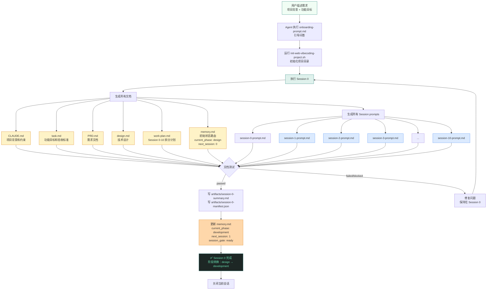
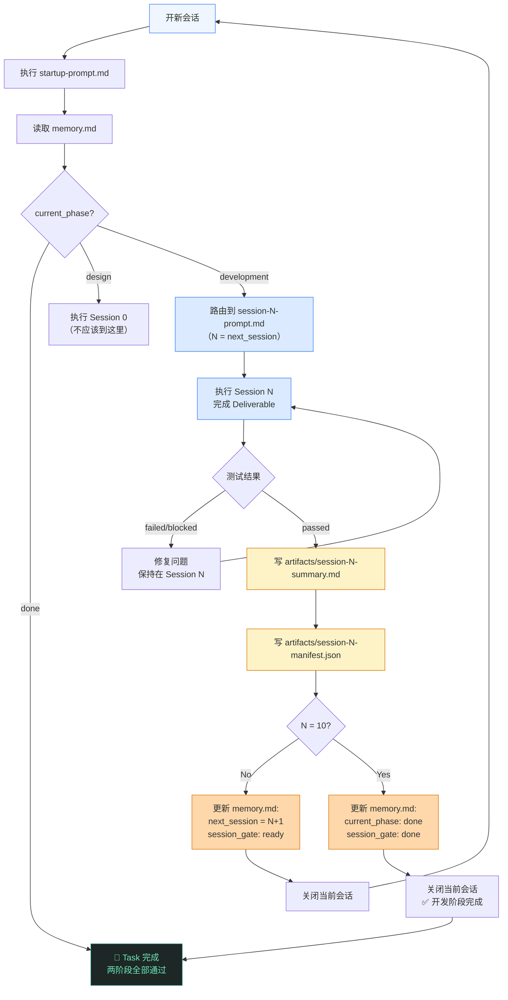
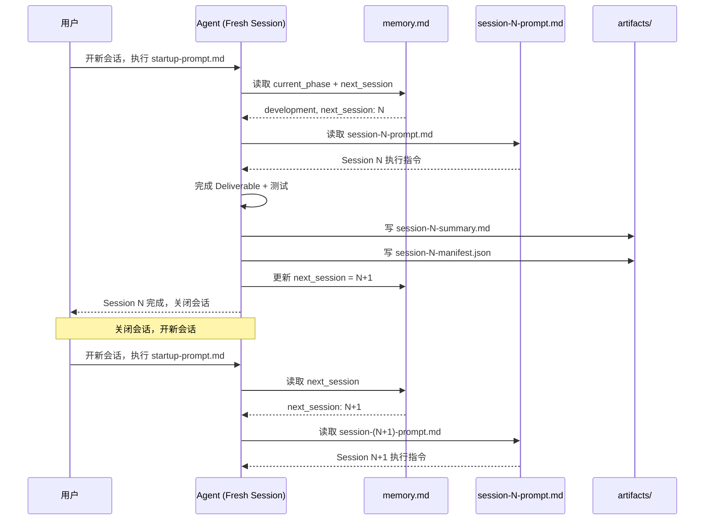

# 两阶段架构详解

## 概述

VibeCoding Workflow 采用**两阶段架构**，将每个 Task 的执行分为两个明确的阶段：

| 阶段 | current_phase | Sessions | 目标 | 产出 |
|------|--------------|----------|------|------|
| **设计阶段** | `design` | Session 0 | 产出全部规划文档和 Session prompts | 文档 + prompts |
| **开发阶段** | `development` | Sessions 1–10 | 逐个执行 Session prompts，实现功能 | 代码 + 测试 |
| **完成** | `done` | — | 流程结束 | — |

---

## Phase 1 — 设计阶段（Design Phase）

### 目标

Session 0 产出：
1. **6 个核心文档**：`CLAUDE.md`, `task.md`, `PRD.md`, `design.md`, `work-plan.md`, `memory.md`
2. **11 个 Session prompts**：`session-0-prompt.md` 到 `session-10-prompt.md`
3. **Session 0 handoff artifacts**：`artifacts/session-0-summary.md` + `artifacts/session-0-manifest.json`

### 完整流程图



### 关键点

1. **Session prompts 在 Session 0 就全部生成好了**
   - `session-1-prompt.md` 到 `session-10-prompt.md` 在设计阶段就写好
   - 每个 prompt 包含该 Session 的 Deliverable、Test Gate、执行指令
   - 开发阶段不需要再生成 prompts，只需逐个执行

2. **阶段转换条件**
   - Session 0 测试通过 → `current_phase: development`, `next_session: 1`
   - 测试失败 → 保持 `current_phase: design`, `next_session: 0`

3. **产出验证**
   - 所有文档存在且内容完整
   - `memory.md` 状态有效
   - `work-plan.md` 包含 Session 0-10 的 Deliverable + Test Gate

---

## Phase 2 — 开发阶段（Development Phase）

### 目标

逐个执行 Session 1 到 Session 10，每个 Session：
1. 读取对应的 `session-N-prompt.md`
2. 完成一个可测试的 Deliverable
3. 通过 Test Gate
4. 写 handoff artifacts
5. 更新 `memory.md`
6. 关闭会话

### 完整流程图



### 每个 Session 的执行模式



### 关键规则

1. **不是批量执行，而是逐个执行**
   ```
   执行 Session 1 → 测试 → 更新 memory.md → 停止 → 关闭会话
   ↓
   开新会话 → 执行 startup-prompt.md → 读取 memory.md → 执行 Session 2 → ...
   ```

2. **每个 Session 在独立的 fresh context 中执行**
   - 不依赖聊天历史
   - 不依赖上一个 Session 的内存状态
   - 只依赖文件：`memory.md`, `task.md`, `design.md`, `work-plan.md`, `session-N-summary.md`

3. **`memory.md` 是唯一路由真相**
   - `current_phase` 决定是设计阶段还是开发阶段
   - `next_session` 决定该执行哪个 Session
   - `session_gate` 决定是否允许推进

4. **阶段转换条件**
   - Session 10 测试通过 → `current_phase: done`, `session_gate: done`
   - 测试失败 → 保持 `current_phase: development`, `next_session: 10`

---

## 两阶段对比

| 维度 | 设计阶段（Phase 1） | 开发阶段（Phase 2） |
|------|-------------------|-------------------|
| **Sessions** | Session 0 | Sessions 1–10 |
| **current_phase** | `design` | `development` |
| **产出类型** | 文档 + Session prompts | 代码 + 测试 |
| **执行次数** | 1 次 | 10 次（逐个） |
| **是否写业务代码** | ❌ 否 | ✅ 是 |
| **Session prompts** | 生成所有 prompts | 逐个执行 prompts |
| **阶段转换** | Session 0 passed → development | Session 10 passed → done |

---

## 常见误解澄清

### ❌ 误解 1：开发阶段需要先生成 Session prompts

**错误理解**：
```
开发阶段 = 计划节点（生成 sessionsubtask.md）→ 执行所有 sessionsubtask.md
```

**正确理解**：
```
Session prompts 在 Session 0 就全部生成好了
开发阶段只是逐个执行这些 prompts
```

### ❌ 误解 2：调度器批量执行所有 Sessions

**错误理解**：
```
调度器一次性执行 Session 1-10
```

**正确理解**：
```
调度器每次只执行一个 Session
执行完后停止，等待下一次调用
```

### ❌ 误解 3：Session 之间可以在同一个会话中连续执行

**错误理解**：
```
Session 1 → Session 2 → Session 3（同一个会话）
```

**正确理解**：
```
Session 1 → 关闭会话 → 开新会话 → Session 2 → 关闭会话 → 开新会话 → Session 3
```

---

## 实际执行示例

### Session 0（设计阶段）

```bash
# 用户发送
请读取 vibecodingworkflow/templates/onboarding-prompt.md，
然后按照其中的步骤引导我开始开发。

# Agent 执行
1. 引导问答，收集需求
2. 运行 init-web-vibecoding-project.sh
3. 生成所有文档（CLAUDE.md, task.md, PRD.md, design.md, work-plan.md, memory.md）
4. 生成所有 Session prompts（session-0-prompt.md 到 session-10-prompt.md）
5. 写 artifacts/session-0-summary.md
6. 写 artifacts/session-0-manifest.json
7. 更新 memory.md: current_phase: development, next_session: 1
8. 停止

# memory.md 状态
current_phase: development
next_session: 1
session_gate: ready
```

### Session 1（开发阶段）

```bash
# 用户关闭会话，开新会话，发送
工作目录切到 <项目目录>
请执行 startup-prompt.md 中的启动流程。

# Agent 执行
1. 读取 memory.md → current_phase: development, next_session: 1
2. 读取 session-1-prompt.md
3. 完成 Session 1 Deliverable（项目骨架）
4. 运行测试
5. 写 artifacts/session-1-summary.md
6. 写 artifacts/session-1-manifest.json
7. 更新 memory.md: next_session: 2
8. 停止

# memory.md 状态
current_phase: development
next_session: 2
session_gate: ready
```

### Session 2（开发阶段）

```bash
# 用户关闭会话，开新会话，发送
工作目录切到 <项目目录>
请执行 startup-prompt.md 中的启动流程。

# Agent 执行
1. 读取 memory.md → current_phase: development, next_session: 2
2. 读取 session-2-prompt.md
3. 完成 Session 2 Deliverable（Schema）
4. 运行测试
5. 写 artifacts/session-2-summary.md
6. 写 artifacts/session-2-manifest.json
7. 更新 memory.md: next_session: 3
8. 停止

# memory.md 状态
current_phase: development
next_session: 3
session_gate: ready
```

### ... 重复直到 Session 10

### Session 10（开发阶段最后一个）

```bash
# Agent 执行
1. 读取 memory.md → current_phase: development, next_session: 10
2. 读取 session-10-prompt.md
3. 完成 Session 10 Deliverable（收尾）
4. 运行测试
5. 写 artifacts/session-10-summary.md
6. 写 artifacts/session-10-manifest.json
7. 更新 memory.md: current_phase: done, session_gate: done
8. 停止

# memory.md 状态
current_phase: done
next_session: none
session_gate: done
```

---

## 总结

两阶段架构的核心原则：

1. **Session prompts 在 Session 0 就全部生成好了**
2. **开发阶段只是逐个执行这些 prompts**
3. **每个 Session 在独立的 fresh context 中执行**
4. **`memory.md` 是唯一路由真相**
5. **不是批量执行，而是逐个执行 → 停止 → 开新会话 → 执行下一个**
