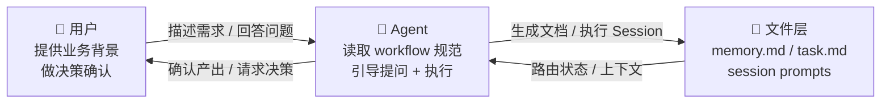
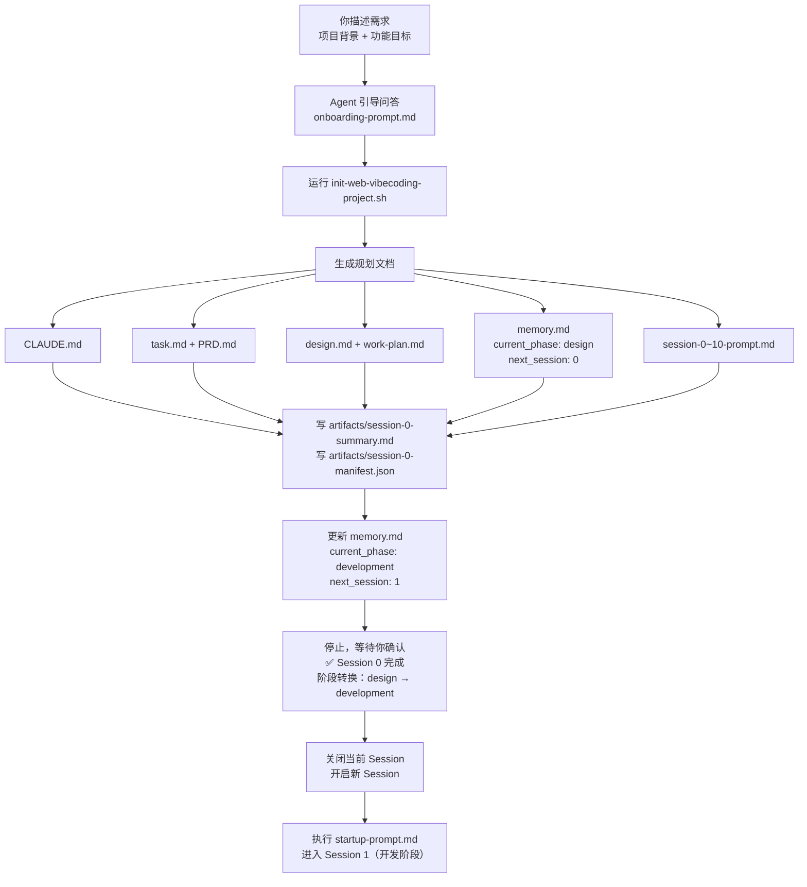
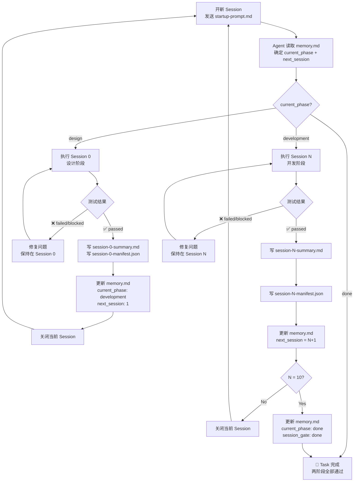

# VibeCoding Workflow 用户手册

## 这个工作流的两个主体

| 主体 | 角色 |
|------|------|
| **你（用户）** | 提供业务背景和需求，做决策和确认 |
| **Agent** | 读取 workflow 规范，主动引导提问，生成文档，执行 Session |

你不需要提前准备好所有信息。Agent 会主动问你。



---

## 准备工作：Clone 项目

```bash
git clone <repo-url> vibecodingworkflow
```

---

## 第一步：让 Agent 读取项目并开始引导

给你的 Agent（Claude Code、Cursor、Codex 等）发送**这一句话**：

```
请读取 vibecodingworkflow/templates/onboarding-prompt.md，
然后按照其中的步骤引导我开始开发。
```

Agent 读取完成后，会主动告知你它已理解工作流，然后开始引导你填写项目信息。

---

## Agent 引导的对话流程

### Agent 读取完成后的输出示例

```
你好！我已读取 VibeCoding Workflow 规范，明白接下来的工作流程。

我将引导你完成以下步骤：
1. 收集项目背景信息 → 生成 CLAUDE.md
2. 确认具体功能需求 → 生成 task.md + PRD.md
3. 生成技术设计和开发计划 → 生成 design.md + work-plan.md
4. 正式进入 Session 循环开发

我们现在开始。请先告诉我项目基本信息：

- 项目名称：
- 客户 / 团队：
- 客户所在地（可选）：
- 系统类型（Web / App / 后端服务 / 其他）：
- 这个系统是做什么的？
- 主要服务对象是谁？
- 有哪些不可违反的约束？
```

### 你的回复示例

```
项目名称：STIC 能效管理平台
客户：STIC 北方创新中心 Fab 厂务部门机械课
客户所在地：北京
系统类型：Web

这个系统用于制冷机房优化策略管理，帮助工程师看指标、管策略、追踪执行结果。
不是 DCS/PLC 控制系统，不直接下发底层指令。
必须保留人工审核和回退入口，可靠性优先于节能收益。
```

### Agent 确认背景后继续引导功能需求

```
项目背景已确认。接下来请描述这次要做的具体功能：

- 功能名称（简短，用作目录名）：
- 功能目标（一句话）：
- 明确要做什么？（主要模块）
- 明确不做什么？
- 用户能做到什么就算完成？
```

### 你的回复示例

```
功能名称：chiller-strategy
功能目标：高效制冷机房策略优化建议管理

要做：
1. 核心指标监控分析（EER/COP/负荷/电量趋势图、预警）
2. 优化策略包管理（列表、详情、收益区间、风险等级）
3. 策略执行闭环（下发→反馈→稳态验证→完成/回退）

不做：实时自动控制，全厂 CUS/HVAC 全覆盖

验收标准：
- 能看核心指标趋势和异常预警
- 能完成策略从建议到稳态验证的完整闭环
- 所有记录可追溯可回退
```

---

## Agent 自动完成 Session 0（设计阶段）

需求确认后，Agent 会自动：

1. 运行 `init-web-vibecoding-project.sh` 初始化项目目录
2. 生成所有规划文档：

| 文件 | 内容来源 |
|------|---------|
| `CLAUDE.md` | 你描述的项目背景和约束 |
| `task.md` | 你确认的功能目标和验收标准 |
| `PRD.md` | 问题定义、用户价值、功能范围 |
| `design.md` | 技术架构、模块边界、业务对象 |
| `work-plan.md` | Session 0-10 拆分，每条含 Deliverable + Test Gate |
| `memory.md` | 初始状态，`current_phase: design`，`next_session: 0` |

3. 写入 `artifacts/session-0-summary.md` 和 `artifacts/session-0-manifest.json`
4. 更新 `memory.md`：`current_phase: development`，`next_session: 1`（阶段转换）
5. 停止，等待你确认



---

## 正式开发：Session 循环（开发阶段）

Session 0 完成后，**关闭当前会话，开一个新会话**，每次只发：

```
工作目录切到 <你的项目目录>
请执行 startup-prompt.md 中的启动流程。
```

Agent 自动从 `memory.md` 读取 `current_phase` 和 `next_session`，执行一个 Deliverable，测试通过后更新状态，然后停止。

**每个 Session 完成后确认三件事：**

```
✅ artifacts/session-N-summary.md 已写入
✅ artifacts/session-N-manifest.json 已写入
✅ memory.md 的 next_session 已更新
✅ 若 Session 10 完成，current_phase 已转为 done
```

然后关闭会话，开新会话，重复上面那句 Prompt。



---

## 参考 Demo

`demo/stic-fab-chiller-strategy/` 展示了完整流程的真实结果：

| 文件 | 说明 |
|------|------|
| `CLAUDE.md` | 项目背景：厂务平台、安全约束 |
| `task.md` | 功能：制冷机房策略管理目标和验收标准 |
| `PRD.md` | 问题定义、用户价值、功能范围 |
| `design.md` | 四层架构、业务对象、执行模型 |
| `work-plan.md` | Session 0-10，每条含 Deliverable + Test Gate |
| `memory.md` | Session 3 完成，`session_gate: ready`，等待 Session 4 |
| `artifacts/session-3-summary.md` | Session 3 交接文档 |

---

## 关键概念速查

| 概念 | 定义 |
|------|------|
| **Project** | 你的整个产品（`CLAUDE.md` 跨所有功能共享） |
| **Task** | 一个二级功能点，3-15 个 Session（`task.md`） |
| **设计阶段** | `current_phase: design`，只含 Session 0，产出全部规划文档 |
| **开发阶段** | `current_phase: development`，Sessions 1-10，逐步实现功能 |
| **Session 0** | 规划 Session，只产文档，不写业务代码，完成后触发阶段转换 |
| **Session 1+** | 每轮一个可测试交付物 |
| **memory.md** | Workflow 路由真相，决定 `current_phase` 和下一个 Session |
| **work-plan.md** | Session 拆分计划，每条含 Deliverable + Test Gate |

---

## 常见问题

**Q: 我需要提前准备什么？**
A: 不需要。只需知道"我要做什么系统"和"这次要实现哪个功能"，Agent 会通过问答帮你整理。

**Q: Session 0 会自动生成 work-plan.md 吗？**
A: 是的。Agent 根据你确认的功能需求，将整个功能拆分为 Session 0-10，每个 Session 都有明确的 Deliverable 和 Test Gate。

**Q: Session 测试失败了怎么办？**
A: `memory.md` 里 `session_gate` 保持 `blocked`，下一个 Session 继续修复同一个 Deliverable，不跳过。

**Q: 需求中途变了怎么办？**
A: 更新 `task.md` 和 `work-plan.md`，在 `memory.md` 里记录变更，然后继续 Session 循环。
