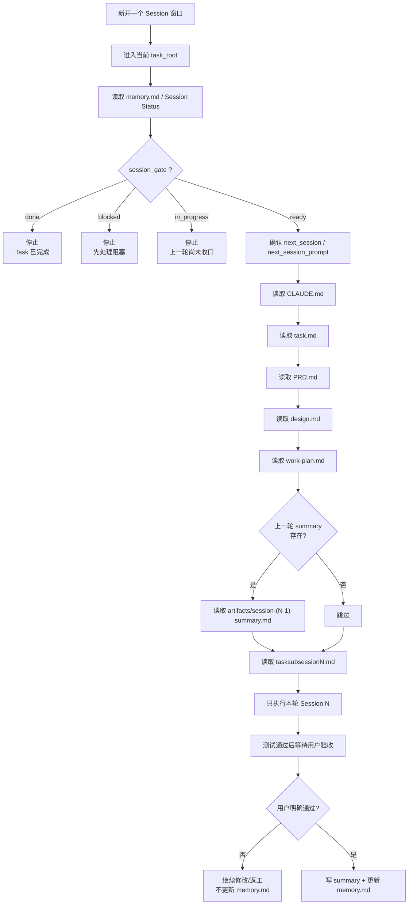

# VibeCoding Workflow 用户手册

> 适用版本：v2.7 | 适用角色：产品经理 | 最后更新：2026-03-20
>
> **v2.7 新增能力：**
> - Session 0a 新增 Step 0：首次运行时先初始化 `customer_context/` 和 `tasks/` 目录，停下来等客户放入背景资料，再进入问卷设计阶段
> - Step 1 问卷自动扫描 `customer_context/` 目录，预填客户资料文件列表，无需手动输入路径
>
> **v2.6 新增能力：**
> - 最终评审原型固定收敛为 `task.html`
> - `task.html` 必须为单文件交付，CSS / JS / 模拟数据全部内联，便于产品经理直接分发给开发评审
>
> **v2.5 新增能力：**
> - 标准目录 contract 固定为 `project_root / task_root`
> - `project_root` 固定包含 `CLAUDE.md`、`customer_context/`、`tasks/`
> - `task_root` 固定补齐 `artifacts/`、`scripts/`、`outputs/`
>
> **v2.4 新增能力：**
> - Session 0a 新增对标目标搜索（Step 1b）和客户资料读取（Step 1c）
> - CLAUDE.md 新增 Benchmark Reference 和 Domain Data 两个 section
> - PRD.md 新增 Design Standard section
>
> **v2.3 新增能力：**
> - Roo Code `/run-session` slash command 作为推荐触发方式（替代手动发送指令）
> - 保留手动触发方式，向后兼容

---

## 概览：这个工作流做什么

**输入：** 你的业务背景 + 功能需求（口述即可）

**输出：**
- `PRD.md` — 产品需求文档（评审核心文档）
- `task.html` — 可交互 HTML 原型，含基于真实业务背景的模拟数据，且为可直接分发的单文件评审包

**你需要做的事只有三件：**

1. 把 `1paperprdasprompt.md` 放到你的 `project_root`
2. 让 Codex/Claude 读取它，按提示初始化目录、放入背景资料、回答问题
3. Session 0 完成后进入当前 `task_root`，逐步确认每个 Session 的结果

---

## 目录 Contract（这次更新的核心）

- `project_root`：当前项目根目录，固定放 `1paperprdasprompt.md`、`CLAUDE.md`、`customer_context/`、`tasks/`
- `task_root = project_root/tasks/<task-slug>/`
- `task_root` 固定放 `task.md`、`PRD.md`、`design.md`、`work-plan.md`、`tasksubsessionN.md`、`memory.md`
- `task_root` 还会预建 `artifacts/`、`scripts/`、`outputs/samples/`、`outputs/reports/`、`outputs/session-specs/`、`outputs/session-logs/`
- Session 0 在 `project_root` 建立目录和文档；Session 1–N 必须在当前 `task_root` 中继续执行

---

## 快速开始（3 步）

**第 1 步：** 在你的 `project_root` 放入 `1paperprdasprompt.md`

**第 2 步：** 首次启动时，在 `project_root` 触发 Session 0

```
请读取 1paperprdasprompt.md，然后按照其中的入口协议开始执行。
```

Codex 会先创建 `customer_context/` 和 `tasks/` 目录，然后停下来等你放入背景资料。

**第 3 步：** 将客户背景资料放入 `customer_context/`，回复"资料已就绪"（无资料可回复"跳过"）。Codex 自动扫描目录、预填文件列表，进入问卷设计阶段。

Session 0 完成后进入当前 `task_root`，再用 Roo Code `/run-session` 或手动触发后续 Session。

---

## Fresh Session 读取锁链

进入 Session 1 及后续 Session 时，不要只让模型读取 `tasksubsessionN.md`。正确方式是先过 `memory.md` 的 gate，再按固定顺序补齐上下文。



用户理解重点：

- `memory.md` 决定“能不能进”和“该进哪一轮”
- `CLAUDE.md` → `task.md` → `PRD.md` → `design.md` → `work-plan.md` 是固定主链
- 上一轮 `summary` 只在存在时插入
- `tasksubsessionN.md` 是最后读取的执行入口，不是第一个入口

建议你在新窗口直接这样说：

```text
请先读取 memory.md，确认当前应执行 tasksubsessionN.md；
然后读取 CLAUDE.md、task.md、PRD.md、design.md、work-plan.md；
如果存在上一轮 summary 也先读取；
最后读取 tasksubsessionN.md，并只执行这一轮。
```

更完整说明见 [`fresh-session-read-chain.md`](fresh-session-read-chain.md)。

---

## 完整示例：从零到 HTML 原型

> 以下是一个真实场景的完整演示，展示整个工作流的每一步对话和产出。
>
> **示例背景：** 产品经理小王，负责 TSMC Fab 厂务平台，这次要做「制冷机房优化策略管理」功能。

---

### 阶段一：Session 0 — 设计阶段

> 目标：产出所有稳定规划文档 + 预生成全量执行文件。不写任何业务代码。
>
> Session 0 分两步：**0a（需求阶段）** 先初始化 `customer_context/`、`tasks/` 目录，等客户放入背景资料后扫描预填，再通过问卷产出 `CLAUDE.md` / `task.md` / `PRD.md`；**0b（规划阶段）** 在同一窗口继续，在 `task_root` 下产出 `design.md` / `work-plan.md` / `tasksubsession1~N.md` / `memory.md`。

---

#### Step 1 — 小王发送启动指令

```
请读取 1paperprdasprompt.md，然后按照其中的入口协议开始执行。
```

Agent 读取文件，发现 `customer_context/` 目录不存在，判断为**首次运行**，进入 Session 0a Step 0。

---

#### Step 1b — Agent 初始化目录，等待客户资料

Agent 创建 `customer_context/` 和 `tasks/` 目录后输出：

```
目录已初始化：
- customer_context/   ← 请将客户背景资料（点位表、系统说明等）放入此目录
- tasks/              ← 功能任务目录（后续自动创建）

准备好后请回复：
- "资料已就绪" — 我将读取资料并开始收集项目信息
- "跳过" — 无背景资料，直接开始填写项目信息
```

小王将两个文件放入 `customer_context/`，回复：`"资料已就绪"`

---

#### Step 2 — Agent 扫描资料，引导收集项目背景

Agent 扫描 `customer_context/` 目录，发现两个文件，输出问卷（客户资料字段已预填）：

```
你好！我已检测到 customer_context/ 目录中的文件，请填写以下项目基本信息：

【项目基本信息】
- 项目名称：
- 系统类型（Web 功能原型）：
- 主要服务对象（用户角色）：
- 对标目标（业界 leader，如"TSMC"）：

【业务背景】
- 这个系统是做什么的？（1-3句话）
- 核心业务场景是什么？

【领域约束】
- 有哪些不可违反的业务规则或安全约束？
- 有哪些明确的技术或合规限制？

【客户资料】
已检测到 customer_context/ 目录中的文件：
  - customer_context/低温冷冻水系统点位表.xlsx
  - customer_context/中温冷冻水系统电表清单.xlsx
  （若列表有误或需补充，请直接修改；若无资料请填"无"）
```

小王回复：

```
项目名称：TSMC 能效管理平台
系统类型：Web
主要服务对象：Fab 厂务部门机械课工程师

业务背景：
制冷机房管理系统，帮助工程师监控 EER/COP 等核心指标、管理节能策略包、
追踪策略执行结果。不是 DCS/PLC 控制系统，不直接下发底层指令。

领域约束：
- 必须保留人工审核和回退入口，可靠性优先于节能收益
- 不得直接控制制冷设备，所有操作需人工确认
- 数据展示需支持 7×24h 历史趋势查询

对标目标：TSMC
客户资料：/path/to/低温冷冻水系统点位表.xlsx, /path/to/中温冷冻水系统电表清单.xlsx
```

Agent 复述摘要确认后继续：

```
项目背景已确认。接下来请描述这次要做的具体功能：
```

---

#### Step 1b — Agent 搜索客户背景与对标信息

Agent 自动搜索三类信息并输出摘要：

```
已完成背景搜索，摘要如下：

【客户基本信息 — TSMC】
- 全称：南京先进半导体技术研究院（TSMC），TSMC位于北京
- 业务性质：半导体制造研发，Fab 厂务系统负责全厂公用工程（冷冻水、压缩空气、纯水等）
- 规模：中型研发 Fab，制冷机房配置离心机 + 螺杆机混合机组

【对标行业地位 — TSMC】
- 全球晶圆代工龙头，2nm 制程量产在即
- 厂务能效管理是TSMC核心竞争力之一，PUE 长期维持在 1.4 以下（行业领先水平）
- TSMC Fab 厂务系统已实现全厂能效数字化管控，制冷系统 EER 实时监控与自动优化

【对标最佳实践 — TSMC能效管理】
- 制冷系统采用分级策略管理：预测性优化 + 实时反馈 + 稳态验证三阶段闭环
- 策略包按季节/负荷段分类，每个策略包含收益预测区间和风险等级评估
- 所有策略执行记录可追溯，支持一键回退，人工审核节点不可绕过

以上信息将写入 CLAUDE.md（Benchmark Reference section）。
请确认是否准确，或有需要补充/修正的内容？
```

小王确认：`"准确，继续"`

---

#### Step 1c — Agent 读取客户资料文件

Agent 分段读取两个文件并输出提取摘要：

```
已读取客户资料文件，提取摘要如下：

【低温冷冻水系统点位表.xlsx】
- 总点位数：247 个
- 关键点位：供水温度（CHWS_TEMP）、回水温度（CHWR_TEMP）、冷冻水流量（CHW_FLOW）、
  机组功率（CHILLER_KW）、EER 计算值（EER_CALC）
- 采集频率：1分钟/次（实时监控点位），15分钟/次（趋势分析点位）
- 单位：温度 °C，流量 m³/h，功率 kW，EER 无量纲

【中温冷冻水系统电表清单.xlsx】
- 总电表数：38 块
- 关键电表：1# 离心机主机电表、2# 离心机主机电表、3# 螺杆机电表、
  冷冻水泵 A/B/C 电表、冷却水泵 A/B 电表
- 采集频率：15分钟/次
- 单位：kWh（累计电量），kW（实时功率）

以上原始数据将写入 CLAUDE.md（Domain Data section）。
请确认是否准确，或有需要补充/修正的内容？
```

小王确认：`"准确，继续"`

---

Agent 继续收集功能信息：

```
请描述这次要做的具体功能：

【功能基本信息】
- 功能名称（简短，用作目录名）：
- 功能目标（一句话）：

【功能范围】
- 明确要做什么？（列出主要模块或能力）
- 明确不做什么？（排除项）

【验收标准】
- 用户能做到什么就算完成？（列出可验证的条件）
```

小王回复：

```
功能名称：chiller-strategy
功能目标：高效管理制冷机房节能策略优化建议，实现从建议到执行的完整闭环

要做：
1. 核心指标看板（EER/COP/负荷/电量趋势图、预警提示）
2. 优化策略包管理（列表、详情、收益区间、风险等级）
3. 策略执行闭环（下发 → 反馈 → 稳态验证 → 完成/回退）

不做：实时自动控制、全厂 CUS/HVAC 覆盖、移动端适配

验收标准：
- 工程师能看到核心指标趋势和异常预警
- 能完成策略从「建议」到「稳态验证」的完整闭环操作
- 所有执行记录可追溯、可回退
```

---

#### Step 3 — Agent 产出所有文档

Agent 分两批生成文件并报告进度：

**Session 0a 产出（需求文档 + 标准目录）：**

```
✅ customer_context/                客户资料目录
✅ tasks/chiller-strategy/          当前功能工作目录
✅ tasks/chiller-strategy/artifacts/ Session 产出目录
✅ tasks/chiller-strategy/scripts/   Task 辅助脚本目录
✅ tasks/chiller-strategy/outputs/   Task 输出目录（samples / reports / session-specs / session-logs）
✅ CLAUDE.md                        项目背景与约束（不含工作流规则，只含业务上下文）
                                   新增 Benchmark Reference section：TSMC行业地位与能效管理最佳实践事实
                                   新增 Domain Data section：点位表/电表清单提取结果（点位数、关键点位、单位、采集频率）
✅ tasks/chiller-strategy/task.md   功能目标与验收标准
✅ tasks/chiller-strategy/PRD.md    产品需求文档（含 User Stories + Feature Specs）
                                   新增 Design Standard section：设计必须达到或超越TSMC对标水准

→ 停止，等待你确认需求文档
```

小王检查三个文件，确认无误后在**同一窗口**回复：`"需求已确认，请继续规划"`

**Session 0b 产出（规划文档）：**

```
✅ tasks/chiller-strategy/design.md        技术架构与模块设计
✅ tasks/chiller-strategy/work-plan.md     Session 1–5 开发计划（Session 5 固定为 HTML 交付）
✅ tasks/chiller-strategy/tasksubsession1.md ~ tasksubsession5.md  执行单元（共 5 个）
✅ tasks/chiller-strategy/memory.md        进度日志（初始状态）
```

**产出文件预览：**

`work-plan.md` 中 Session 规划如下（本例 PRD 有 3 个功能模块，按决策标准拆为 4+1 个 Session）：

| Session | Deliverable | Test Gate |
|---------|-------------|-----------|
| Session 1 | 核心指标看板（EER/COP 趋势图 + 预警组件） | 图表可渲染，预警逻辑可触发 |
| Session 2 | 策略包列表与详情页 | 列表可筛选，详情展示收益区间和风险等级 |
| Session 3 | 策略执行下发与反馈模块 | 下发流程完整，反馈可记录 |
| Session 4 | 稳态验证与回退逻辑 | 验证流程完整，回退操作可执行 |
| **Session 5（固定）** | **`task.html` 可交互原型** | HTML 可直接浏览器打开，模拟数据符合 TSMC 业务背景，且 CSS / JS / HTML 全部内联 |

---

#### Step 4 — Agent 停止，等待小王确认

```
Session 0b 完成！规划文档已生成：

【技术设计】
- tasks/chiller-strategy/design.md, tasks/chiller-strategy/work-plan.md

【执行单元（可直接使用）】
- tasks/chiller-strategy/tasksubsession1.md ~ tasksubsession5.md（共 5 个）

【进度日志】
- tasks/chiller-strategy/memory.md（Session 0 已完成，下一步：Session 1）

请检查以上文件，确认内容准确。
如需修改，直接编辑对应文件。

确认无误后，先进入 `tasks/chiller-strategy/`，再开启新会话，发送：
"请读取 tasksubsession1.md 并按其中步骤执行"
```

小王检查文档，确认无误。**Session 0 结束，关闭此对话窗口。**

---

### 阶段二：Session 1–4 — 执行阶段（功能实现）

> 每个 Session 开启新对话窗口，Agent 读取对应 tasksubsession 文件后执行。

---

#### Session 1 执行

小王先进入 `tasks/chiller-strategy/`，再**开启新对话窗口**触发执行（推荐使用 Roo Code）：

**方式一（推荐）：** 在 VS Code 中使用 Roo Code 发送 `/run-session`，自动读取当前 `task_root` 下的 `memory.md` 并执行 Session 1。

**方式二（手动）：** 发送：

```
请读取 tasksubsession1.md 并按其中步骤执行
```

Agent 读取 `tasksubsession1.md`，其中"上下文读取"清单为：
- `../../CLAUDE.md`（项目背景）
- `task.md`（功能目标）
- `design.md`（架构设计）
- ~~artifacts/session-0-summary.md~~ ← **Session 1 无前序 summary，这是正常情况，直接执行**

Agent 测试通过后，先输出结果等待验收：

```
Session 1 测试通过
Tests: passed ✅

完成内容：核心指标看板组件，EER/COP 趋势图可渲染，预警逻辑已实现

请确认结果是否符合预期：
- 验收通过 → 回复"通过"或"继续"，我将写 summary 并更新 memory.md
- 需要修改 → 直接说明修改内容，我在本窗口继续调整
```

小王确认结果满意，回复**"通过"**。Agent 写入 summary 并更新进度：

```
Session 1 完成
Summary: artifacts/session-1-summary.md
memory.md 已更新

下一步：当你准备好后，开启新会话并发送：
"请读取 tasksubsession2.md 并按其中步骤执行"
```

小王**关闭此对话窗口。**

---

#### Session 2、3、4 — 同样流程

每次开新窗口 → 触发执行（`/run-session` 或手动发送指令）→ Agent 测试通过后等待验收 → 回复"通过" → 关闭窗口。

Agent 每次执行前都会读取上一 Session 的 `artifacts/session-N-summary.md` 作为上下文交接。

**上下文交接链：**

```
Session 2 读取 → artifacts/session-1-summary.md
Session 3 读取 → artifacts/session-2-summary.md
Session 4 读取 → artifacts/session-3-summary.md
```

---

#### 真实场景：Session 3 验收时发现需求大改

小王在 Session 3 验收时发现策略执行流程与实际业务不符，与 Codex 讨论后决定：
- 新增一个"策略模拟预演"模块（In Scope 模块增加）
- 修改 PRD.md，将原 Session 3 的"策略执行下发"拆分为"模拟预演"和"正式下发"两个模块

这属于**大改**（In Scope 模块增减），触发大改流程。

**Step 1：停止当前 Session**

小王停止 Session 3，不写 summary，不更新 memory.md。

**Step 2：修改需求文档**

小王编辑 `tasks/chiller-strategy/PRD.md`，在 Feature Specifications 中新增"策略模拟预演"模块。

**Step 3：重新执行 Session 0b**

小王开启新窗口，发送：

```
请读取 1paperprdasprompt.md，重新执行 Session 0b
```

Agent 读取更新后的 `tasks/chiller-strategy/PRD.md`，重新产出：
- `tasks/chiller-strategy/design.md`（模块边界变化，重新生成）
- `tasks/chiller-strategy/work-plan.md`（Session 数从 5 个变为 6 个）
- `tasks/chiller-strategy/tasksubsession1.md ~ tasksubsession6.md`（全量重新生成）
- `tasks/chiller-strategy/memory.md` 追加变更记录：
  ```
  需求变更 2026-03-18：新增"策略模拟预演"模块，work-plan.md 已更新
  变更级别：Major / 重新规划：work-plan.md 已更新
  ```

**Step 4：Agent 输出复用评估表**

```
需求变更后，已完成 Session 的交付物复用评估：

| Session | 交付物 | 与新需求兼容性 | 建议 | 用户决定 |
|---------|--------|--------------|------|---------|
| Session 1 | 核心指标看板 | ✅ 兼容 | 复用 | □ 复用 □ 重做 |
| Session 2 | 策略包列表与详情 | ✅ 兼容 | 复用 | □ 复用 □ 重做 |
| Session 3 | 策略执行下发 | ❌ 不兼容（已拆分为两个模块） | 重做 | □ 复用 □ 重做 |

请逐行确认后回复，我将从第一个"重做"的 Session 开始执行。
```

**Step 5：小王确认复用决策**

小王回复：

```
Session 1 复用
Session 2 复用
Session 3 重做
```

Agent 追加 `tasks/chiller-strategy/memory.md`：

```
复用决策：Session 1 复用 / Session 2 复用 / Session 3 重做
```

**Step 6：从 Session 3 重新开始**

小王开启新窗口，发送：

```
请读取 tasksubsession3.md 并按其中步骤执行
```

Agent 按新的 tasksubsession3.md（现在是"策略模拟预演"模块）执行，后续 Session 4（正式下发）、Session 5（稳态验证与回退）、Session 6（HTML 交付）依次执行。

---

#### 异常情况：如果 summary 文件缺失

假设小王在执行 Session 3 时，Agent 发现 `artifacts/session-2-summary.md` 为空：

```
⚠️ 上下文缺失：artifacts/session-2-summary.md 不存在或为空

memory.md 检查结果：
- Session 2 无完成记录。

建议：先执行 tasksubsession2.md，完成后再执行本 Session。

请确认处理方式后继续。
```

Agent **停止等待**，小王回头先执行 Session 2。

---

### 阶段三：Session 5 — 最终 HTML 原型交付

> 这是核心交付物产出阶段。

小王**开启新对话窗口**，触发执行（推荐 `/run-session`，或手动发送 `请读取 tasksubsession5.md 并按其中步骤执行`）。

Agent 读取文件，进入 HTML 原型生成模式。执行清单：

```
上下文读取：
✅ ../../CLAUDE.md  TSMC 厂务平台业务背景
✅ PRD.md           功能范围 + User Stories
✅ design.md        四层架构设计
✅ artifacts/session-4-summary.md  上一轮交接
```

Agent 生成 `task.html`，模拟数据严格按照 CLAUDE.md 业务背景编写：

| 模拟数据项 | 内容示例 |
|-----------|---------|
| 机组列表 | 1# 离心机、2# 离心机、3# 螺杆机…（≥5条） |
| 策略包列表 | 夜间低负荷优化包、夏季峰值节能包… |
| EER 趋势数据 | 基于 TSMC 北京厂区实际运行时段的模拟曲线 |
| 执行记录 | 含工程师姓名、下发时间、稳态验证结果… |

Agent 生成完成后，先输出结果等待验收：

```
Session 5 测试通过
Tests: passed ✅

task.html 已生成，可在浏览器直接打开。
模拟数据覆盖：机组列表、策略包、EER 趋势、执行记录，均基于 TSMC 业务背景。

请确认结果是否符合预期：
- 验收通过 → 回复"通过"或"继续"，我将写 summary 并更新 memory.md
- 需要修改 → 直接说明修改内容，我在本窗口继续调整
```

小王打开文件确认演示效果，回复**"通过"**。Agent 完成收尾：

```
✅ 核心交付物已完成：

- tasks/chiller-strategy/PRD.md（产品需求文档）
- tasks/chiller-strategy/task.html（可交互原型 + 模拟数据）

Session 5 完成
Summary: artifacts/session-5-summary.md
memory.md 已更新 → 项目状态: 全部完成
```

**小王直接把 `task.html` 发给开发和评审方，在浏览器中即可打开查看。**

---

### 标准工程目录（单 Task 示例）

```
my-project/
├── 1paperprdasprompt.md     ← 工作流规范（只需一个文件）
├── CLAUDE.md                  ← TSMC 项目背景与约束
├── customer_context/          ← 客户资料目录
└── tasks/
    └── chiller-strategy/
        ├── task.md                    ← 功能目标
        ├── PRD.md                     ← ✅ 核心交付物①：产品需求文档
        ├── design.md                  ← 四层架构设计
        ├── work-plan.md               ← Session 1–5 计划
        ├── task.html                  ← ✅ 核心交付物②：可交互原型（单文件评审包）
        ├── tasksubsession1.md         ← 已执行
        ├── tasksubsession2.md         ← 已执行
        ├── tasksubsession3.md         ← 已执行
        ├── tasksubsession4.md         ← 已执行
        ├── tasksubsession5.md         ← 已执行
        ├── memory.md                  ← 进度日志（全部完成）
        ├── scripts/
        │   └── .gitkeep
        ├── outputs/
        │   ├── samples/
        │   ├── reports/
        │   ├── session-specs/
        │   └── session-logs/
        └── artifacts/
            ├── session-1-summary.md
            ├── session-2-summary.md
            ├── session-3-summary.md
            ├── session-4-summary.md
            └── session-5-summary.md
```

这个目录就是 One Paper v2.5 的**标准初始化结果**。即使当前只有一个功能，也统一放在 `tasks/<task-slug>/` 下。

### 多 Task 项目扩展示例

如果一个 project 同时包含多个二级功能，推荐改为下面的布局：

```text
my-project/
├── 1paperprdasprompt.md
├── CLAUDE.md
├── customer_context/
├── tasks/
│   ├── chiller-strategy/
│   │   ├── task.md
│   │   ├── PRD.md
│   │   ├── design.md
│   │   ├── work-plan.md
│   │   ├── tasksubsession1.md
│   │   ├── tasksubsession2.md
│   │   ├── memory.md
│   │   ├── scripts/
│   │   ├── outputs/
│   │   └── artifacts/
│   └── alarm-dashboard/
│       ├── task.md
│       ├── PRD.md
│       ├── design.md
│       ├── scripts/
│       ├── outputs/
│       └── ...
└── src/ 或其他共享业务文件
```

规则很简单：

- `CLAUDE.md` 是项目级，跨多个 Task 共享
- `customer_context/` 是项目级，统一存放客户资料
- `task.md` 是 Task 级，`1 Task = 1 个二级功能点`
- 如果当前 Task 只需要读取部分客户资料，这份“必读文件清单”应维护在 `task.md` 的 `Required Customer Context` section
- `task.html` 固定生成在当前 `task_root/` 根目录，不放在 `artifacts/` 或 `outputs/` 下
- `task.html` 必须内联 CSS、JavaScript 和模拟数据，不再额外输出 `styles.css`、`app.js`、`core-models.js` 等运行时文件
- Session 1–N 必须在当前 `task_root` 中执行，而不是在项目根目录执行

---

## 核心机制说明

### Session 数量是怎么决定的

Agent 根据 PRD 中 Feature Specifications 的模块数量决定 Session 数：

| PRD 功能模块数 | Session 数（含最终 HTML Session） |
|---|---|
| 1–2 个 | 2–3 个 |
| 3–4 个 | 3–5 个 |
| 5 个及以上 | 5–8 个 |

本例 PRD 有 3 个功能模块（指标看板、策略包管理、执行闭环），拆为 4 个执行 Session + 1 个 HTML Session，共 5 个。

---

### 每个 Session 的上下文链

每个 tasksubsession 文件都是**自包含的执行单元**，明确列出需要读取的文件：

```
普通 Session（N > 1）读取：
  project_root/CLAUDE.md（在 task_root 内相对路径为 ../../CLAUDE.md） + task.md（含 Required Customer Context） + design.md + artifacts/session-[N-1]-summary.md

最终 HTML Session 读取：
  project_root/CLAUDE.md（在 task_root 内相对路径为 ../../CLAUDE.md） + task.md（含 Required Customer Context） + PRD.md + design.md + artifacts/session-[N-1]-summary.md
```

**你不需要手动传递任何上下文。** 文件即上下文，session summary 是跨窗口的交接文档。

---

### memory.md 的作用

memory.md 是**给你（人类）看的进度日志**，不是给 Agent 的路由指令。

| 谁用 | 何时用 | 用途 |
|------|--------|------|
| 你 | 随时 | 查看"现在做到哪一步了" |
| Agent | summary 缺失时 | 辅助判断上一 Session 是否完成 |

---

### 用户决策点

每个 Session Agent 输出结果后，你有三种选择：

| 决策 | 操作 |
|------|------|
| ✅ 验收通过 | 回复"通过"/"继续"→ Agent 写 summary、更新 `task_root/memory.md` → 开新会话执行下一个 |
| 🔧 需要修改 | 直接说明修改内容 → Agent 在同一窗口调整 → 再次等待你验收 |
| ❌ 方向不对 | 修改 tasksubsessionN.md，开新窗口重新执行 |
| 🔄 需求小改 | 更新 `task_root/task.md` / `task_root/design.md`，修改受影响的 tasksubsession 文件，从当前 Session 重新执行 |
| 🔄 需求大改 | 见下方"需求大改处理流程" |

---

### 需求大改处理流程（v2.2 新增）

**什么情况算"大改"？**

满足任一条件即视为大改：
- In Scope 有模块增减（新增或删除功能模块）
- 已完成 Session 的交付物与新需求不兼容
- 核心数据模型或交互流程根本性变化

**大改处理步骤：**

```
1. 停止当前 Session（不写 summary，不更新 memory.md）

2. 开启新窗口，发送：
   "请读取 1paperprdasprompt.md，重新执行 Session 0b"

   Agent 会：
   → 读取更新后的 `CLAUDE.md`、`tasks/<task-slug>/task.md`、`tasks/<task-slug>/PRD.md`
   → 重新产出 `tasks/<task-slug>/design.md`（模块边界变化时）、`tasks/<task-slug>/work-plan.md`、`tasks/<task-slug>/tasksubsession1~N.md`
   → `tasks/<task-slug>/memory.md` 追加变更记录

3. Session 0b 完成后，Agent 输出复用评估表：

   需求变更后，已完成 Session 的交付物复用评估：

   | Session | 交付物 | 与新需求兼容性 | 建议 | 用户决定 |
   |---------|--------|--------------|------|---------|
   | Session 1 | 核心指标看板 | ✅ 兼容 | 复用 | □ 复用 □ 重做 |
   | Session 2 | 策略包列表 | ⚠️ 部分兼容 | 修改后复用 | □ 复用 □ 重做 |
   | Session 3 | 执行下发模块 | ❌ 不兼容 | 重做 | □ 复用 □ 重做 |

4. 你逐条确认后，Agent 从第一个"重做"的 Session 开始重新执行
```

**示例场景：**

小王在 Session 3 验收时发现需求不对，与 Codex 讨论后修改了 PRD.md，新增了一个"策略模拟预演"模块。这属于 In Scope 模块增减，触发大改流程。

Agent 重新规划后输出评估表，小王确认 Session 1（指标看板）可复用，Session 2（策略包列表）需修改后复用，Session 3（执行下发）需重做。Agent 从 Session 2 开始重新执行。

---

### 恢复进度（已有 memory.md 时）

如果中断后重新开始，发送同样的启动指令：

```
请读取 1paperprdasprompt.md，然后按照其中的入口协议开始执行。
```

Agent 发现 `memory.md` 已存在，会主动推断并建议：

```
当前进度：Session 3 已完成。

建议执行 tasksubsession4.md。
先进入当前 `task_root`，再发送 "请读取 tasksubsession4.md 并按其中步骤执行" 即可继续。
```

**特殊情况：规划文档已存在但 memory.md 缺失**

如果 `CLAUDE.md` 和 `tasks/<task-slug>/task.md` / `PRD.md` / `work-plan.md` 都在，但 `tasks/<task-slug>/memory.md` 被误删，Agent 会自动创建 `tasks/<task-slug>/memory.md` 并初始化为 Session 0 完成状态，然后等待你确认下一步。不需要重新执行 Session 0。

**特殊情况：项目已全部完成**

如果 memory.md 中包含"项目状态: 全部完成"，Agent 会输出：

```
✅ 项目已全部完成。核心交付物：PRD.md + task.html

如需迭代新功能，请更新当前 task_root 下的 task.md / PRD.md 后告知我，我将重新规划。
```

Agent 不会建议执行不存在的后续 tasksubsession。

---

## 关键概念速查

| 概念                                 | 定义                             |
| ---------------------------------- | ------------------------------ |
| **Session 0**                      | 设计阶段，只产文档，不写业务代码               |
| **Session 1–N**                    | 执行阶段，每轮一个可交付物                  |
| **最后一个 Session**                   | 固定产出可交互 HTML 原型                |
| **tasksubsessionN.md**             | 自包含执行单元，你执行时发送给 Agent 的指令文件    |
| **artifacts/session-N-summary.md** | Session 完成报告，下一 Session 的上下文交接 |
| **memory.md**                      | 人类可读的进度日志                      |
| **project_root / task_root**       | 项目根目录 / 当前任务工作根目录              |
| **CLAUDE.md**                      | 项目级背景，跨所有功能共享，基本不变             |
| **PRD.md**                         | 核心交付物①，产品评审文档                  |
| **task.html**                       | 核心交付物②，可直接分发评审的单文件交互原型        |

---

## 常见问题

**Q: 我需要提前准备什么？**
A: 不需要。只需知道"做什么系统"和"这次实现哪个功能"，Agent 会通过问答帮你整理。

**Q: 测试通过了，Agent 会不会自动写 summary？**
A: 不会。测试通过后 Agent 只输出结果并等待你验收。只有你明确回复"通过"/"继续"后，Agent 才会写 `artifacts/session-N-summary.md` 并更新 `memory.md`。测试通过 ≠ Session 完成，你的验收确认 = Session 完成。

**Q: 我已经有 CLAUDE.md 了，但 `tasks/<task-slug>/task.md` 不存在，会怎么处理？**
A: Agent 会判断需求文档"部分存在"，进入 Session 0a 补全缺失的文件，并补齐标准目录，然后停止等待你确认。不会直接跳到 Session 0b。

**Q: 每个 Session 必须开新对话窗口吗？**
A: 是的。每个 Session 对应独立的对话窗口。新窗口保证 Agent 以干净状态读取 tasksubsession 文件，避免旧对话上下文干扰执行。

**Q: Session 0 产出的 tasksubsession 文件能修改吗？**
A: 可以。执行前可以直接编辑对应的 tasksubsession 文件调整子任务或验收标准。修改后重新执行即可。

**Q: Session 测试失败了怎么办？**
A: Agent 会告知失败原因，memory.md 不更新。你可以修改 tasksubsessionN.md 后重新执行，或直接让 Agent 修复后重跑测试。

**Q: 需求中途变了怎么办？**
A: 分两种情况：
- **小改/中改**（措辞调整、单模块范围变化）：更新 `tasks/<task-slug>/task.md` / `design.md`，修改受影响的 tasksubsession 文件，从当前 Session 重新执行。
- **大改**（In Scope 模块增减、核心流程根本变化）：触发大改流程，Agent 重新执行 Session 0b 产出新规划，输出复用评估表，你逐条确认后从第一个"重做"的 Session 开始执行。详见"需求大改处理流程"。

**Q: 我想修改 CLAUDE.md，Agent 会怎么处理？**
A: Agent 会先提醒你"CLAUDE.md 通常不改，只有项目级约束发生根本变化时才需要更新"，然后明确确认"是否真的需要修改 CLAUDE.md？"。只有你确认"需要"且确属项目级约束根本变化时，才会进入大改流程。如果只是局部需求或实现细节变化，Agent 会按小改/中改处理，不修改 CLAUDE.md。

**Q: 大改后，已完成的 Session 会被全部推倒重做吗？**
A: 不会。Agent 会输出复用评估表，逐条评估每个已完成 Session 的交付物与新需求的兼容性（✅ 兼容 / ⚠️ 部分兼容 / ❌ 不兼容），你逐条确认后，Agent 只重做你标记为"重做"的 Session，其余复用。

**Q: 最终 HTML 的模拟数据从哪里来？**
A: Agent 从 `CLAUDE.md` 的业务背景中提取行业、角色、场景等信息，结合 `PRD.md` 的功能范围生成。你在 Session 0 填写的业务背景越详细，模拟数据越贴近真实。

**Q: 给开发评审时，需要再带 `styles.css`、`app.js` 这些文件吗？**
A: 不需要。最终原型固定为 `task.html`，CSS / JavaScript / 模拟数据全部内联在这个文件里。产品经理分发给开发或评审方时，只需要这一份文件。

**Q: 只有一个文件 `1paperprdasprompt.md` 就够了吗？**
A: 是的。这是单文件交付模式的核心设计——客户只需获取这一个文件，大模型即运行时，零依赖。

**Q: Session 0b 执行到一半中断了怎么办？**
A: 重新发送启动指令，Agent 会检测到 design.md 已存在但 work-plan.md 不存在，自动从 work-plan.md 开始继续产出，不会覆盖已有的 design.md。

**Q: CLAUDE.md 里为什么没有工作流规则了？**
A: v2.2 版本将工作流规则移到了 1paperprdasprompt.md 的 SECTION 4，CLAUDE.md 只保留项目业务上下文。这样每个 Session 读取 CLAUDE.md 时不会被工作流规则占用上下文空间。

---

**Q: 对标目标有什么用？**
A: 对标目标（如TSMC）用于两个地方：一是 Agent 在 Step 1b 搜索该对标企业的行业地位和最佳实践，写入 CLAUDE.md 的 Benchmark Reference section，作为设计参考事实；二是 PRD.md 的 Design Standard section 会明确要求"设计必须达到或超越对标水准"，让评审方看到设计依据。填写越具体（如"TSMC制冷系统能效管理"），搜索结果越精准。

**Q: 客户资料文件太大读不完怎么办？**
A: Agent 会采用分段读取策略：结构化文件（Excel/CSV）优先读取表头和前 50 行，提取字段名、单位、采集频率等元数据；非结构化文件（Word/PDF）按章节分段读取，每段确认后继续。如果文件超出单次读取限制，Agent 会告知已读取的范围和提取结果，你可以决定是否继续读取剩余部分。核心目标是提取"有哪些数据、数据结构是什么"，而非读完全部原始数据。

**Q: 客户资料的内容会写进哪些文档？**
A: 分三层写入：原始数据提取结果（点位名、单位、采集频率、数量统计等）写入 CLAUDE.md 的 Domain Data section，作为项目级资料摘要；当前 Task 真正必读的客户资料文件清单写入 task.md 的 `Required Customer Context` section；设计依据（基于客户资料得出的设计结论，如"需支持 247 个点位的实时展示"）写入 PRD.md 的 Feature Specs，作为功能需求的来源说明。

**Q: 如果 customer_context/ 里有很多文件，但这个 Task 只需要其中几份，应该写在哪里？**
A: 写在当前 `task_root/task.md` 的 `Required Customer Context` section。`customer_context/` 只是项目级资料池；真正“这个 Task 执行前必须读哪几个文件”，应由 `task.md` 明确列出路径、用途和必读原因。

**Q: Roo Code `/run-session` 和手动发送指令有什么区别？**
A: 效果相同，触发方式不同。`/run-session` 适合 Session 0 完成后的常规推进：进入当前 `task_root` 后，它会自动读取 `memory.md` 解析 `next_session`，省去手动确认当前进度的步骤。手动方式更适合首次启动 Session 0，或需要明确指定当前执行文件的情况。两种方式都支持，可以混用。

**Q: 什么时候用 `/run-session`，什么时候手动触发？**
A: 正常推进时用 `/run-session`，更省心。以下情况建议手动触发：需要跳过某个 Session、重新执行特定 Session、或执行 Session 0b 重新规划时。

**Q: `/run-session` 需要额外安装什么吗？**
A: 需要在项目目录下有 `.roo/commands/run-session.md` 文件（由 vibecodingworkflow 初始化脚本生成），并在 VS Code 中安装 Roo Code 扩展。
