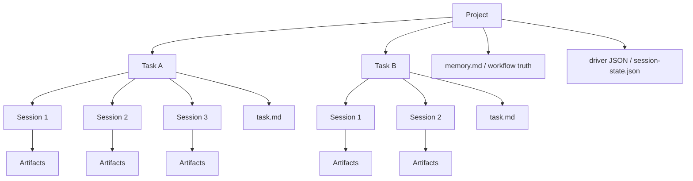

# Workflow Standard

## Execution Model

This workflow is best understood as five layers:

- `Project`: the repository or workspace that contains one or more deliverables
- `Task`: one business goal or feature-level objective inside the project
- `Session`: one fresh execution round that advances exactly one concrete slice of a task
- `Artifacts`: the evidence produced by a session, such as diffs, summaries, and test reports
- `memory.md`: the workflow routing truth that decides whether the next session may advance

Recommended relationship:

- `1 project -> multiple tasks`
- `1 task -> multiple sessions`
- `1 session -> one scoped deliverable with one test gate`
- `1 completed session -> one session summary handoff`

## Core Rule

Always re-enter through `startup-prompt.md`. Never jump directly into `session-N-prompt.md` after a previous session ends.

## State Machine

- `memory.md` is the only source of truth
- `session_gate = ready` means the next session may start
- `failed` or `blocked` means stay on the current session
- `done` means the flow is complete

## Task Rule

- one task = one business goal
- one task = one `startup-prompt.md`
- one task = one `memory.md`
- one task usually spans multiple sessions
- `task.md` defines the task-level objective and acceptance criteria

## Session Rule

- one session = one deliverable
- one session = one test gate
- no cross-session implementation
- no "code complete but untested" handoff

## Progress Loop

- finish current session
- write `artifacts/session-N-summary.md`
- update `memory.md`
- end the current session
- start a fresh session or fresh context
- re-enter through `startup-prompt.md`
- read `task.md`
- read the previous session summary when it exists
- let `memory.md` route the next session

## Preferred Execution Mode

- preferred: one deliverable per fresh session
- do not rely on automatic continuation inside the same chat after the previous session ends
- let an external driver or the engineer start the next fresh session

## External Driver Pattern

Typical implementation:

- one task holds `task.md`, `startup-prompt.md`, and `memory.md`
- one external driver reads `memory.md`
- the driver resolves the previous session summary
- the driver writes a machine-readable next-session spec
- the driver starts a fresh session
- that fresh session runs `startup-prompt.md`
- the driver waits for the session to end and checks `memory.md` again

## Legacy Compatibility

This repository now treats `task.md` as required.

- legacy workflow projects should be migrated explicitly
- do not add runtime fallback that guesses task state from old prompt-only files
- use [`scripts/migrate-vibecoding-project.sh`](../scripts/migrate-vibecoding-project.sh) to add the required task-centered scaffolding
