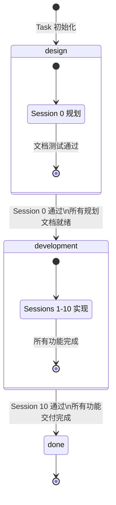
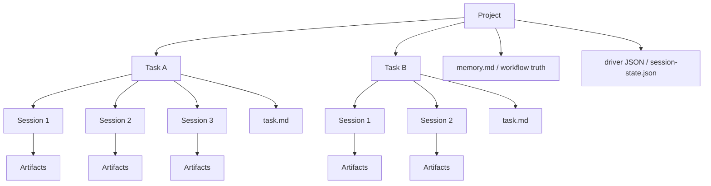
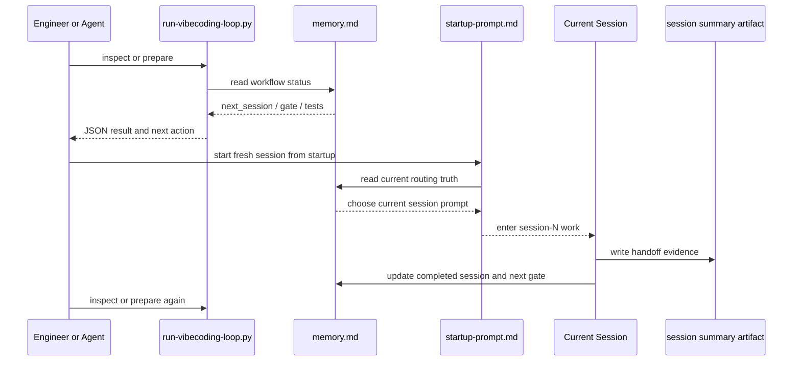

# Workflow Standard

## Two-Phase Architecture

This workflow is structured as **two distinct phases**:

| Phase | current_phase | Sessions | 目标 | 结束条件 |
|-------|--------------|----------|------|----------|
| **设计阶段** | `design` | Session 0 | 产出全部规划文档，不写业务代码 | Session 0 tests: passed |
| **开发阶段** | `development` | Session 1–10 | 按 Session 逐步实现功能 | Session 10 tests: passed |
| **完成** | `done` | — | 流程全部结束 | — |



### Phase Transition Rules

- **design → development**: Session 0 完成且 `tests: passed` → `current_phase: development`, `next_session: 1`
- **development → done**: Session 10 完成且 `tests: passed` → `current_phase: done`, `session_gate: done`
- 任意 Session 未通过 → 不转换阶段，不推进 `next_session`

详细流程图和常见误解澄清见 [`docs/two-phase-architecture.md`](two-phase-architecture.md)。

---

## Execution Model

This workflow is best understood as five layers:

- `Project`: the repository or workspace that contains one or more deliverables
- `Task`: one business goal or feature-level objective inside the project
- `Session`: one fresh execution round that advances exactly one concrete slice of a task
- `Artifacts`: the evidence produced by a session, such as diffs, summaries, and test reports
- `memory.md`: the workflow routing truth that decides whether the next session may advance

### Task Granularity Definition

A `Task` should be scoped as a **feature-level objective** (Epic or large User Story), typically:

- **Recommended scope**: One complete user-facing feature or one major technical capability
- **Time estimate**: 3-15 sessions (roughly 1-5 days of focused work)
- **Complexity**: Can be broken down into 5-15 concrete deliverables (sessions)
- **Independence**: Should be independently testable and deployable

**Examples of appropriate Task scope**:
- ✅ "User authentication system" (login, registration, password reset)
- ✅ "Product catalog with search and filters"
- ✅ "Real-time monitoring dashboard"
- ✅ "Payment integration with Stripe"

**Examples of inappropriate Task scope**:
- ❌ Too large: "Complete e-commerce platform" (should be multiple Tasks)
- ❌ Too small: "Add a button to the navbar" (should be part of a larger Task)
- ❌ Too vague: "Improve performance" (needs specific acceptance criteria)

**Relationship to product hierarchy**:
```
Product / Project
└── Epic (usually 1 Task or multiple related Tasks)
    └── Task (1 Task = 1 feature-level objective)
        └── Session (1 Session = 1 concrete deliverable)
            └── Artifact (evidence of completion)
```

Recommended relationship:

- `1 project -> multiple tasks`
- `1 task -> multiple sessions`
- `1 session -> one scoped deliverable with one test gate`
- `1 completed session -> one session summary handoff`



## End-to-End Architecture

```mermaid
flowchart TB
    A["Business Project or Legacy Workflow"] --> B["Initialization Layer"]
    B --> B1["scripts/init-web-vibecoding-project.sh"]
    B --> B2["scripts/migrate-vibecoding-project.sh"]

    B1 --> C["Task-Centered Workflow Project"]
    B2 --> C

    C --> D["Workflow Truth Layer"]
    D --> D1["task.md"]
    D --> D2["memory.md"]
    D --> D3["startup-prompt.md"]
    D --> D4["session-N-prompt.md"]
    D --> D5["artifacts/session-N-summary.md"]

    D --> E["Orchestration Layer"]
    E --> E1["scripts/run-vibecoding-loop.py"]
    E1 --> E2["inspect | prepare | run"]
    E2 --> E3["outputs/session-specs/session-N-spec.json"]
    E2 --> E4["outputs/session-logs/vibecoding-loop.jsonl"]

    D --> F["Execution Layer"]
    F --> F1["Fresh session or fresh context"]
    F1 --> F2["Always enter through startup-prompt.md"]
    F2 --> F3["Session-N deliverable"]
    F3 --> F4["Tests / gate check"]
    F4 --> F5["Update memory.md + write summary"]
    F5 --> E

    E1 --> G["IDE Integration Layer"]
    G --> G1["VS Code extension UI shell"]
    G1 --> G2["Refresh / Prepare / Open Files / Runner"]
    G2 --> E1

    C --> H["Verification Layer"]
    H --> H1["scripts/verify-vibecoding-workflow.sh"]
    H --> H2["fixture project checks"]
    H --> H3["extension smoke / regression / real scenario"]
```



## Layer Responsibilities

- `Initialization`: create a new workflow project or migrate an old prompt-only project into the current contract.
- `Workflow Truth`: keep routing and handoff state in files, not in chat memory or UI cache.
- `Orchestration`: let the Python driver read `memory.md`, decide whether the next session may advance, and emit machine-readable handoff output.
- `Execution`: complete one scoped deliverable per fresh session, then update `memory.md` and write the session summary artifact.
- `Integration`: expose the same flow in VS Code without taking ownership of workflow truth.
- `Verification`: prove the contract with repository checks, fixtures, and integration scripts.

## Runtime Sequence



## Core Rule

Always re-enter through `startup-prompt.md`. Never jump directly into `session-N-prompt.md` after a previous session ends.

## State Machine

- `memory.md` is the only source of truth
- `session_gate = ready` means the next session may start
- `failed` or `blocked` means stay on the current session
- `done` means the flow is complete

## Task Rule

- one task = one business goal
- one task = one `startup-prompt.md`
- one task = one `memory.md`
- one task usually spans multiple sessions
- `task.md` defines the task-level objective and acceptance criteria

## Session Rule

- one session = one deliverable
- one session = one test gate
- no cross-session implementation
- no "code complete but untested" handoff

## Progress Loop

- finish current session
- write `artifacts/session-N-summary.md`
- update `memory.md`
- end the current session
- start a fresh session or fresh context
- re-enter through `startup-prompt.md`
- read `task.md`
- read the previous session summary when it exists
- let `memory.md` route the next session

## Preferred Execution Mode

- preferred: one deliverable per fresh session
- do not rely on automatic continuation inside the same chat after the previous session ends
- let an external driver or the engineer start the next fresh session

## External Driver Pattern

Typical implementation:

- one task holds `task.md`, `startup-prompt.md`, and `memory.md`
- one external driver reads `memory.md`
- the driver resolves the previous session summary
- the driver writes a machine-readable next-session spec
- the driver starts a fresh session
- that fresh session runs `startup-prompt.md`
- the driver waits for the session to end and checks `memory.md` again

## Legacy Compatibility

This repository now treats `task.md` as required.

- legacy workflow projects should be migrated explicitly
- do not add runtime fallback that guesses task state from old prompt-only files
- use [`scripts/migrate-vibecoding-project.sh`](../scripts/migrate-vibecoding-project.sh) to add the required task-centered scaffolding
