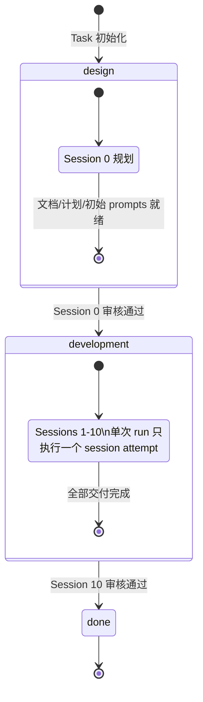
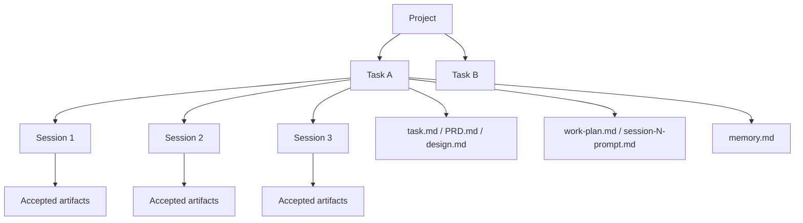
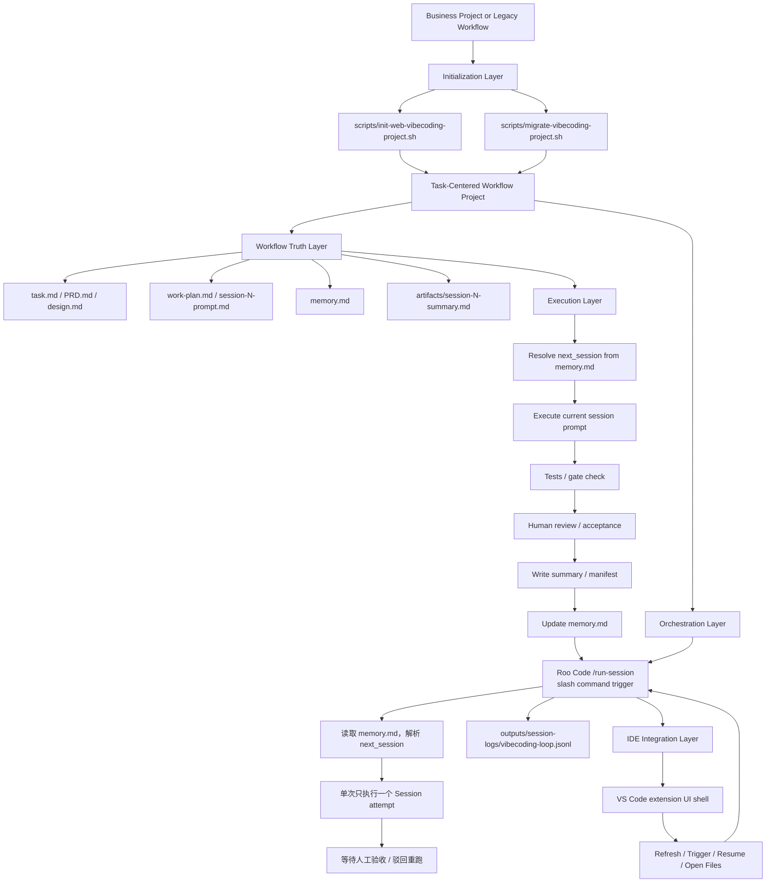
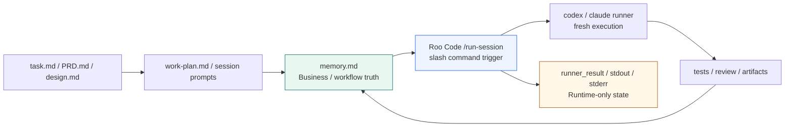
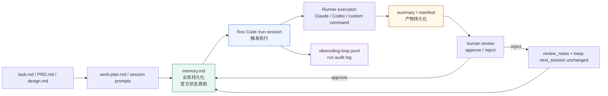
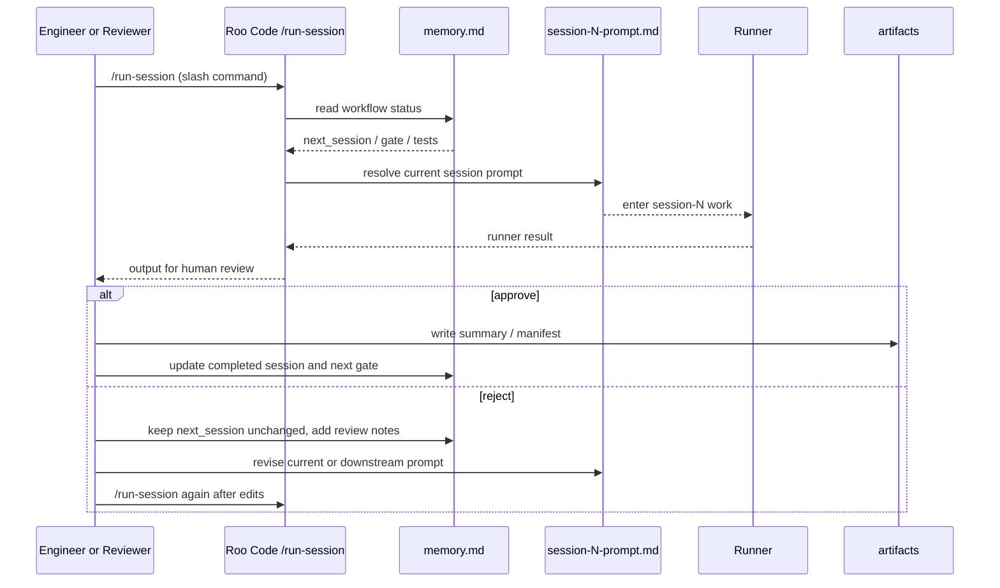

# Workflow Standard

> 2026-03-19 设计更新：Orchestration Layer 使用 Roo Code `/run-session` slash command。单 session 显式触发 + 人工验收后才推进业务状态的核心机制不变。

## Two-Phase Architecture

This workflow is structured as **two distinct phases**:

| Phase | current_phase | Sessions | 目标 | 结束条件 |
|-------|--------------|----------|------|----------|
| **设计阶段** | `design` | Session 0 | 产出初始规划文档、`work-plan.md`、Session prompts，不写业务代码 | Session 0 审核通过 |
| **开发阶段** | `development` | Session 1–10 | 按 Session 逐步实现功能，每次执行后进入人工验收 | Session 10 审核通过 |
| **完成** | `done` | — | 流程全部结束 | — |



### Phase Transition Rules

- `design -> development`: Session 0 规划文档与初始 prompts 通过审核，`current_phase: development`，`next_session: 1`
- `development -> done`: Session 10 交付物通过人工验收，`current_phase: done`，`session_gate: done`
- 任意 Session 被驳回：不推进 `next_session`
- 任意 Session 驳回后：允许先更新 `PRD.md`、`design.md`、`task.md`，再修订 `work-plan.md` 与当前/后续 `session-N-prompt.md`

See [`docs/two-phase-architecture.md`](two-phase-architecture.md) for the expanded flow.

## Execution Model

This workflow is best understood as five layers:

- `Project`: the repository or workspace that contains one or more deliverables
- `Task`: one business goal or feature-level objective inside the project
- `Session`: one explicit execution round that advances exactly one concrete slice of a task
- `Artifacts`: the evidence produced by an accepted session, such as diffs, summaries, manifests, and test reports
- `memory.md`: the workflow routing truth that decides whether the next session may advance

### Task Granularity Definition

A `Task` should be scoped as a **feature-level objective**:

- Recommended scope: one complete user-facing feature or one major technical capability
- Time estimate: 3-15 sessions
- Complexity: can be broken down into 5-15 concrete deliverables
- Independence: should be independently testable and reviewable

Recommended relationship:

- `1 project -> multiple tasks`
- `1 task -> multiple sessions`
- `1 session -> one scoped deliverable with one review gate`
- `1 accepted session -> one session summary handoff`



## End-to-End Architecture



## Layer Responsibilities

- `Initialization`: create a new workflow project or migrate an old prompt-only project into the current contract.
- `Workflow Truth`: keep routing and handoff state in files, not in chat memory or UI cache.
- `Orchestration`: Roo Code `/run-session` slash command 读取 `memory.md`，执行一个 session attempt，然后暂停等待人工验收后才推进。
- `Execution`: complete one scoped deliverable per run, then wait for acceptance before updating `memory.md` and writing official artifacts.
- `Integration`: expose the same flow in VS Code without taking ownership of workflow truth.
- `Verification`: prove the contract with repository checks, fixtures, and integration scripts.

## Session 0a Sub-Steps

Session 0a（需求阶段）现在包含三个顺序子步骤，全部在同一对话窗口内完成：

| 子步骤 | 触发条件 | Agent 行为 | 产出 |
|--------|----------|-----------|------|
| **Step 1a — 问卷收集** | 首次运行，无 memory.md | 引导用户填写项目背景、功能范围、对标目标、客户资料路径 | 结构化问卷回答 |
| **Step 1b — 背景搜索** | 问卷填写完成 | 自动搜索三类信息：客户基本信息、对标行业地位、对标最佳实践；输出摘要等待确认 | Benchmark Reference 内容草稿 |
| **Step 1c — 资料读取** | Step 1b 确认后 | 分段读取客户资料文件（结构化文件读表头+前50行，非结构化按章节分段）；输出提取摘要等待确认 | Domain Data 内容草稿 |

三个子步骤全部确认后，Agent 产出需求文档：

- `CLAUDE.md` — 项目业务上下文，包含两个新 section：
  - `Benchmark Reference`：对标目标的行业地位与最佳实践事实（来自 Step 1b 搜索结果）
  - `Domain Data`：客户资料提���结果，原始数据字段、单位、采集频率等（来自 Step 1c 读取结果）
- `task.md` — 功能目标与验收标准
- `PRD.md` — 产品需求文档，包含新 section：
  - `Design Standard`：基于对标水准的设计要求，放入评审文档供评审方参考

Session 0a 完成后停止，等待用户确认需求文档，再继续 Session 0b（规划阶段）。

## Claude Planning And Execution Strategy

When a human drives a task through Claude Code, the recommended interaction
pattern is a separate planning pass followed by an execution pass:

| Pass | Command | Purpose | Expected output |
|---|---|---|---|
| Planning | `claude --model opusplan --permission-mode plan` | Analyze repository context, identify affected files, and produce an implementation plan before any edits | file list, rationale, implementation order, validation commands, risk notes |
| Execution | `claude --model opusplan --permission-mode acceptEdits` | Apply the approved plan as the smallest verifiable slice and report validation status | concrete file edits, test results, open risks |

Design intent:

- `opusplan` is the preferred alias because it uses stronger planning behavior in `plan` mode and cheaper/faster execution behavior outside `plan` mode.
- When a project wants explicit 1M context for both passes, configure the shell environment as:

```bash
export ANTHROPIC_DEFAULT_OPUS_MODEL='claude-opus-4-6[1m]'
export ANTHROPIC_DEFAULT_SONNET_MODEL='claude-sonnet-4-6[1m]'
```

- With the above settings, `opusplan` resolves to `claude-opus-4-6[1m]` during the planning pass and `claude-sonnet-4-6[1m]` during the execution pass.
- 1M context is intended for large repositories, long design reviews, and cross-file analysis; it should be treated as an opt-in performance/cost tradeoff rather than a universal default.
- Claude `plan` / `acceptEdits` are runner interaction modes. They do not replace workflow business state such as `current_phase`, `next_session`, or `session_gate`.
- Session 0 planning, cross-file refactors, rejected-review re-plan, and architecture-heavy changes should start with the planning pass.
- The execution pass should consume an already reviewed plan rather than rediscover scope mid-edit.
- Any shell execution remains constrained by repository permission policy such as `.claude/settings*.json`.

Recommended operator loop:

1. Run the planning pass and ask Claude to inspect `README.md`, the relevant `docs/`, implementation files under `src/` or `scripts/`, and corresponding tests.
2. Review the plan and confirm the target file set, sequence, and verification commands.
3. Start the execution pass and instruct Claude to implement only the approved slice.
4. Run validation, perform human review, and only then allow the workflow to advance through `memory.md`.

## Business Truth Vs Runtime State

The workflow deliberately keeps two different kinds of state:

- `memory.md`: the business/workflow truth
- orchestration runtime state: Roo Code run status, session execution output, runner stdout/stderr

They are related, but they are not the same layer and must not replace each other.

### Why Both Exist

- `memory.md` answers: "从 workflow 的官方角度，现在完成到哪一轮，下一轮是谁，能不能推进？"
- runtime state answers: "这次执行跑到哪里，runner 是否完成，是否在等待人工验收，能否继续 resume？"

### Responsibility Split

| Layer | Canonical artifact | Main question it answers |
|---|---|---|
| Business truth | `memory.md` | What is the official workflow status for this task? |
| Runtime orchestration | Roo Code run output / session execution log | What is happening inside this execution run right now? |

### State Relationship Diagram



Interpretation:

- `memory.md` decides official workflow progress.
- Roo Code `/run-session` triggers current execution.
- runner output becomes official only after artifacts are written, customer review passes, and `memory.md` is updated.

## Persistence Design

The workflow persists three different classes of data. They serve different recovery and audit purposes and should not be merged into one layer.

### Persistence Layers

| Layer | Primary artifacts | Owner | Purpose |
|---|---|---|---|
| Business persistence | `memory.md` | workflow contract | Persist the official task/session status and routing truth |
| Artifact persistence | `artifacts/session-N-summary.md`, `artifacts/session-N-manifest.json` | accepted session output | Persist evidence that one session attempt was accepted |
| Runtime persistence | Roo Code session output / `outputs/session-logs/vibecoding-loop.jsonl` | orchestration runtime | Persist run audit trail and execution context |

### Persistence Flow Diagram



### Persistence Rules

- `memory.md` is the only business-truth persistence layer. UI cache, thread state, or local variables must not replace it.
- Roo Code `/run-session` is the trigger mechanism, not workflow truth. It answers whether a run was triggered, not whether a session is officially complete.
- `session-N-summary.md` and `session-N-manifest.json` are acceptance evidence. They should represent an accepted session output, not a transient draft result.
- `outputs/session-logs/vibecoding-loop.jsonl` is an append-only audit trail for runs. It records what happened during execution even if the business state does not advance.
- Reject means restoring the current session as the official position: keep `next_session` unchanged, write `review_notes`, and block advancement until the current slice is corrected.

### Recovery Semantics

- Recover business status from `memory.md`.
- Recover accepted deliverable evidence from `artifacts/`.
- Recover historical run trace from `outputs/session-logs/vibecoding-loop.jsonl`.

## Runtime Sequence



## Core Rules

- Roo Code `/run-session` is the recommended trigger for starting a session execution.
- Each `/run-session` handles at most one current-session execution attempt.
- Each `session-N-prompt.md` is an independent acceptance unit. Reject keeps the workflow on the same session number until that prompt passes review.
- A runner success does not mean the workflow has advanced.
- Official advancement happens only after customer acceptance, artifact write, and `memory.md` update.
- Always re-enter through `startup-prompt.md` when using a human-driven fresh session; do not jump directly into a stale `session-N-prompt.md`.
- `work-plan.md` and `session-N-prompt.md` are not immutable; they may be revised after rejected review.

## State Machine

- `memory.md` is the only source of truth for business progression.
- `session_gate = ready` means the next session may start.
- `session_gate = in_progress` means a session is currently running.
- `session_gate = blocked` means the session failed review or hit a blocker and must be reworked.
- `session_gate = done` means the entire workflow is complete.
- Roo Code `/run-session` is a trigger mechanism; its run status is not a business state enum.

```text
ready
  -> /run-session (Roo Code slash command)
  -> in_progress
  -> runner finished
  -> waiting for human review
  -> approve -> ready / done
  -> reject  -> blocked

blocked
  -> update PRD/design/task if needed
  -> revise work-plan/session prompt
  -> /run-session same session again
```
