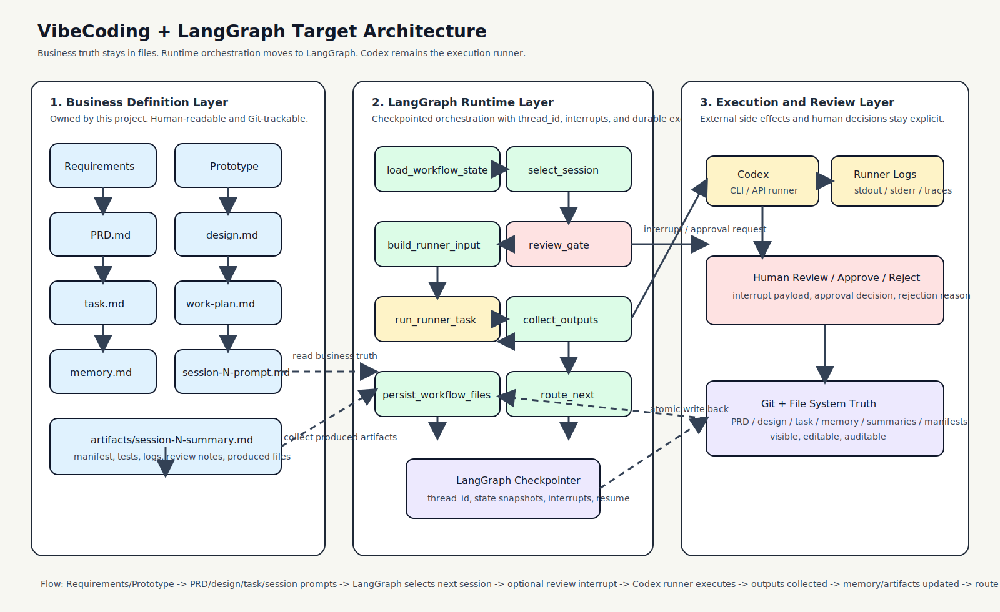

# 本项目 + LangGraph 集成方案

> **[架构决策已确认 - 2026-03-16]**
> 经过完整可行性评估，已确认以 LangGraph Local Server 替代 `run-vibecoding-loop.py` 作为执行运行时。
> 详细评估见：`plans/langgraph-direct-integration-evaluation.md`
> 迁移 Sessions 已排入 `work-plan.md`（Session 11–13）。

> 目标：保留本项目现有的 `需求 -> PRD -> design -> task -> session` 业务生成链路，引入 LangGraph 作为执行层和调度运行时，让 Claude Code/Codex 可以持续推进、暂停审批、失败恢复、跨天续跑。

## 一、结论

**已采纳**，按以下边界集成：

- **本项目负责业务真相源**
  - 需求整理
  - `PRD.md`
  - `design.md`
  - `task.md`
  - `work-plan.md`
  - `memory.md`
  - `session-N-prompt.md`
  - `artifacts/session-N-summary.md`
- **LangGraph 负责执行运行时**（替代 `run-vibecoding-loop.py`）
  - 节点编排（8 节点图）
  - 状态 checkpoint
  - `thread_id` 级恢复
  - human-in-the-loop 暂停/恢复
  - subprocess 调 Claude Code / Codex CLI

这意味着：**LangGraph 不是替代本项目，而是替代当前手写调度器（`run-vibecoding-loop.py`）的大部分运行时职责。**

## 二、为什么用 LangGraph

LangGraph 官方定位是一个 **low-level orchestration framework and runtime**，适合长运行、带状态、可暂停、可恢复的 agent/workflow。它提供的核心能力刚好覆盖本项目当前调度层想做的事情：

- **Persistence / Checkpoints**：每一步执行都可以保存图状态。
- **Durable Execution**：中断、失败、隔天继续后可以从已保存状态恢复。
- **Interrupts / HITL**：在关键节点暂停，等待人工审批后继续。
- **Thread-based state**：通过 `thread_id` 将一个任务实例的运行状态串起来。

官方文档：

- LangGraph Overview: [https://docs.langchain.com/oss/python/langgraph/overview](https://docs.langchain.com/oss/python/langgraph/overview)
- Persistence: [https://docs.langchain.com/oss/python/langgraph/persistence](https://docs.langchain.com/oss/python/langgraph/persistence)
- Interrupts: [https://docs.langchain.com/oss/python/langgraph/interrupts](https://docs.langchain.com/oss/python/langgraph/interrupts)
- Durable Execution: [https://docs.langchain.com/oss/python/langgraph/durable-execution](https://docs.langchain.com/oss/python/langgraph/durable-execution)

## 三、目标边界

### 3.1 要做什么

- 继续保留本项目的文档生成和 session 拆分能力
- 用 LangGraph 接管执行状态机
- 用 LangGraph 接管暂停、恢复、重试、审批门
- 用 LangGraph 调 Codex / CLI / 其他 runner

### 3.2 不做什么

- 不把业务文档存进 LangGraph 内部作为唯一真相源
- 不让 LangGraph 代替 `PRD/design/task/session` 生成逻辑
- 不把本项目重做成通用 agent framework
- 不把 `memory.md` 全部废掉

## 四、核心关系图



## 五、核心设计原则

### 5.1 双层真相源

必须区分两类状态：

- **业务真相源**：文件系统
  - `PRD.md`
  - `design.md`
  - `task.md`
  - `work-plan.md`
  - `memory.md`
  - `artifacts/`
- **运行时真相源**：LangGraph Checkpoint
  - 当前跑到哪个 node
  - 当前 thread 是否被 interrupt
  - 最近一次 runner 执行结果
  - 当前审批等待点

### 5.2 文件不进黑盒

对你这种“产品经理 + 独立开发者”场景，文件必须继续可见、可读、可手改。  
LangGraph 只保存运行快照，**不取代文件系统的可读性和可维护性**。

### 5.3 Side Effects 必须显式化

根据 LangGraph 官方 durable execution 要求，外部副作用需要做成 task，并尽量保证幂等：

- 调 Codex CLI
- 写 summary
- 写 manifest
- 更新 `memory.md`
- 写审批记录

否则恢复执行时会出现重复写入或重复调用。

## 六、推荐架构

### 6.1 分层

| 层 | 归属 | 责任 |
|---|---|---|
| 需求/规划层 | 本项目 | 需求、PRD、design、task、session prompts 生成 |
| 业务状态层 | 本项目 | `memory.md`、summary、manifest、artifacts |
| 运行时编排层 | LangGraph | 节点流转、暂停、恢复、重试、checkpoint |
| 执行器层 | Codex / Claude Code / CLI | 实际写代码、改文档、跑命令 |
| 人工验收层 | 你 | 审批、驳回、修订要求 |

### 6.2 推荐目录增量

```text
vibecodingworkflow/
├── docs/
│   ├── langgraph-integration-plan.md
│   └── assets/langgraph-integration.svg
├── integrations/
│   └── langgraph-runner/
│       ├── graph.py
│       ├── state.py
│       ├── nodes/
│       │   ├── load_workflow_state.py
│       │   ├── select_session.py
│       │   ├── build_runner_input.py
│       │   ├── review_gate.py
│       │   ├── run_codex.py
│       │   ├── persist_outputs.py
│       │   └── finalize_transition.py
│       └── checkpointer.py
```

## 七、状态模型

### 7.1 本项目保留的状态

仍然放在 `memory.md`：

- `current_phase`
- `last_completed_session`
- `last_completed_session_tests`
- `next_session`
- `next_session_prompt`
- `session_gate`
- `review_notes`

### 7.2 LangGraph 运行时状态

建议单独定义 `WorkflowRuntimeState`：

```python
class WorkflowRuntimeState(TypedDict):
    project_root: str
    task_title: str | None
    current_phase: str
    next_session: str
    next_session_prompt: str
    session_gate: str
    previous_summary_path: str | None
    expected_summary_path: str | None
    runner_payload: dict | None
    runner_result: dict | None
    approval_required: bool
    approval_decision: str | None
    rejection_reason: str | None
```

### 7.3 `thread_id` 设计

建议：

```text
thread_id = sha1(project_root + ":" + task_identifier)
```

含义：

- 一个 task 一个 thread
- 同一个 task 跨多天、多次执行都复用同一 `thread_id`
- 这样 checkpoint 才能真正支持持续续跑

## 八、推荐执行图

### 8.1 节点定义

建议第一版只保留 8 个核心节点：

1. `load_workflow_state`
   - 读取 `memory.md` / `task.md` / `design.md` / `work-plan.md`
   - 构造 LangGraph state

2. `select_session`
   - 判断当前该跑哪个 session
   - 检查是否 `ready` / `blocked` / `pending_review` / `done`

3. `build_runner_input`
   - 组装发给 Codex 的输入
   - 包括 startup、session prompt、previous summary、运行约束

4. `review_gate`
   - 如需人工确认，调用 `interrupt()`
   - 等待批准、驳回、编辑要求

5. `run_runner_task`
   - 通过 task 调 Codex / CLI
   - 返回执行结果和产物路径

6. `collect_outputs`
   - 检查 summary、manifest、tests、runner logs

7. `persist_workflow_files`
   - 原子更新 `memory.md`
   - 写 summary / manifest / 审批结果

8. `route_next`
   - 判断结束、继续、重试、等待审批

### 8.2 边关系

```text
load_workflow_state
  -> select_session
  -> build_runner_input
  -> review_gate
  -> run_runner_task
  -> collect_outputs
  -> persist_workflow_files
  -> route_next
```

异常路径：

- `select_session -> route_next`：流程已完成或被阻塞
- `review_gate -> route_next`：等待审批，不执行 runner
- `collect_outputs -> review_gate`：高风险产物先人工确认再推进
- `persist_workflow_files -> build_runner_input`：自动连续推进下一 session

## 九、HITL 审批怎么落到 LangGraph

LangGraph 的 `interrupt()` 非常适合替代你当前文档里的 review gate。

### 9.1 对应关系

| 本项目概念 | LangGraph 能力 |
|---|---|
| `session_gate = pending_review` | `interrupt()` 暂停 |
| 人工批准 | `Command(resume=...)` 恢复并写 `ready` |
| 人工驳回 | `Command(resume=...)` 恢复并写 `blocked + review_notes` |
| 隔天继续 | 同一个 `thread_id` 恢复 |

### 9.2 建议模式

- Session 完成后，不立即自动推进
- `collect_outputs` 判断该 session 需审批
- 进入 `review_gate`
- `interrupt()` 返回审批载荷给外部 UI/CLI
- 你批准后，再 resume

示意：

```python
def review_gate(state: WorkflowRuntimeState):
    if not state["approval_required"]:
        return {}
    decision = interrupt({
        "type": "session_review",
        "next_session": state["next_session"],
        "summary_path": state["expected_summary_path"],
    })
    return {"approval_decision": decision}
```

## 十、持久化策略

### 10.1 推荐分工

- **文件系统**
  - 面向人类
  - 业务真相源
  - Git 可追踪
- **LangGraph Checkpointer**
  - 面向运行时恢复
  - 暂停点和节点进度
  - runner 结果缓存

### 10.2 推荐 durability

第一版建议：

- 本地开发：`async`
- 生产/长期任务：`sync`

原因：

- `sync` 更稳，适合跨天持续任务和审批中断
- `async` 适合本地试跑，性能更轻

### 10.3 幂等要求

以下操作必须设计成幂等：

- 写 `session-N-summary.md`
- 写 `session-N-manifest.json`
- 更新 `memory.md`
- 调 Codex CLI / runner

最稳妥的做法：

- 用唯一执行 ID
- 写文件前检查是否已有同一 run 的产物
- `memory.md` 用原子写入
- 每次 runner 调用落日志

## 十一、与当前 Python Driver 的关系

### 11.1 当前 driver 继续保留的部分

可以复用：

- `memory.md` 解析逻辑
- next session spec 结构
- loop log 结构
- workflow 文件校验

### 11.2 建议被 LangGraph 替换的部分

建议逐步替换：

- `inspect / prepare / run` 的线性状态推进
- 手写暂停/恢复逻辑
- 外部 runner 执行后的手动 re-check
- review gate 的分散处理

### 11.3 最合理的迁移方式

不是一次性推翻，而是：

1. 先保留当前 driver 作为 fallback
2. 新增 `langgraph-runner/`
3. 用同一套 `memory.md` 和 artifacts 验证两套执行器结果一致
4. 再把 VS Code 扩展切到 LangGraph backend

## 十二、推荐的 MVP

第一版不要做全量自动调度，只做最小闭环：

### MVP 范围

- 读取现有 workflow files
- 选择 `next_session`
- 生成 runner 输入
- 调 Codex CLI 一次
- 写 summary / manifest
- 更新 `memory.md`
- 支持一次人工审批暂停
- 支持中断后恢复

### MVP 不做

- 多任务调度池
- 分布式 worker
- 自动并发 session
- 多 runner 编排
- 图形化任务编辑器

## 十三、推荐实施顺序（已更新为确认执行计划）

### Phase 1（Session 11）

- 修正现有 `memory.md` 枚举
- 统一 review gate 契约
- 抽出原子写文件工具
- 实现 LangGraph 执行图 8 个核心节点
- 补充 `pyproject.toml` LangGraph 依赖
- 与 Python driver 并行验证结果一致性

### Phase 2（Session 12）

- VSCode Extension driver 层切换到 LangGraph HTTP API
- 实现 HITL resume 流程（approve / reject）
- 新增 `pending_review` 状态展示
- 新增 LangGraph server 存活检查与提示

### Phase 3（Session 13）

- 执行完整回归矩阵（基于 LangGraph 后端）
- 验证边界场景：blocked / server 不在线 / checkpoint 恢复
- 真机 VS Code Extension Host 手工验证
- 下线 `run-vibecoding-loop.py`（标记为 archived）
- VSIX 打包与发布

## 十四、最终建议

最推荐的架构不是：

- “本项目全废掉，改成 LangGraph”
- “用 Python 手写状态机替代 LangGraph”（重复造轮子）

而是：

- **本项目继续做业务工作流定义层**
- **LangGraph 做调度运行时**（替代 `run-vibecoding-loop.py`）
- **Claude Code / Codex 做执行器**（由 LangGraph subprocess 调用）

一句话总结：

> 你的项目定义”做什么”，LangGraph 决定”怎么持续跑下去”，Claude Code / Codex 负责”真正把活干掉”。