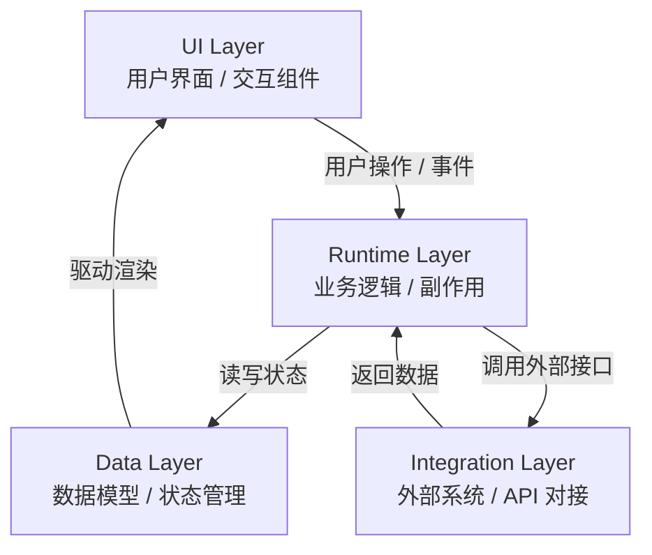
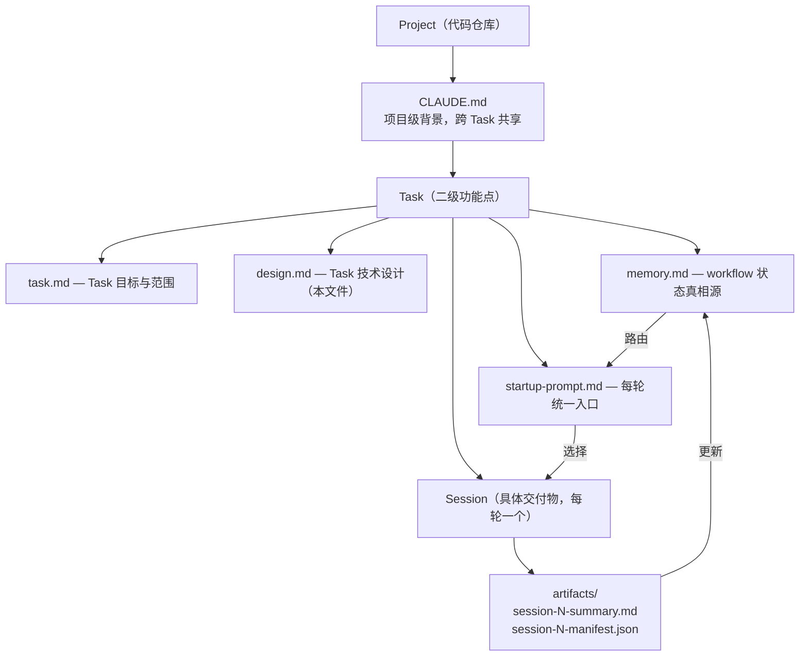

# design.md

## 文件职责说明

`design.md` 是 **Task 级**技术设计文档，与 `task.md` 配套，定义本 Task 的架构决策。
每个 Task 独立维护一份，不跨 Task 共享。

---

## Goal
- 定义模块边界
- 定义输入输出
- 定义验证路径

## Architecture

### 分层结构
- UI Layer：用户界面与交互
- Data Layer：数据模型与状态
- Runtime Layer：业务逻辑与副作用
- Integration Layer：外部系统对接



### 模块边界
- 描述各模块的职责和边界
- 定义模块间的接口契约

### 数据流
- 描述核心数据流向
- 定义关键数据结构

## Key Technical Decisions
- 记录关键技术选型及理由
- 记录被否决的方案及原因

## Execution Model



- `Task` 是业务目标单位（一个二级功能点）
- `Session` 是执行单位（一个具体可交付物）
- 一个 Task 通常由 3-15 个 Session 完成
- 一个 Session 只推进一个明确子目标，对应一个测试 gate
- `memory.md` 是 workflow routing truth
- `startup-prompt.md` 是每轮 fresh session 的统一入口

### Claude Execution Strategy

本工作流默认采用“先规划、后执行”的 Claude 双阶段运行策略。这里的
`plan` / `acceptEdits` 是 Claude Code 的执行模式，不等同于 workflow 里的
`current_phase = design | development` 或 `Session 0..N` 业务状态。

| Stage | Recommended command | Effective model behavior | 目标 | 是否写文件 |
|---|---|---|---|---|
| Planning pass | `claude --model opusplan --permission-mode plan` | `opusplan` 在 plan mode 下优先使用 Opus | 阅读仓库、识别影响面、生成实施计划与验证清单 | 否 |
| Execution pass | `claude --model opusplan --permission-mode acceptEdits` | `opusplan` 在非 plan mode 下转为 Sonnet 执行 | 根据已确认计划改文件、补测试、收口验证 | 是 |

- `opusplan` 是推荐默认别名：规划阶段优先用更强推理模型，执行阶段切换到更高性价比模型。
- 若需要显式启用 1M context，可在 shell 配置中固定：

```bash
export ANTHROPIC_DEFAULT_OPUS_MODEL='claude-opus-4-6[1m]'
export ANTHROPIC_DEFAULT_SONNET_MODEL='claude-sonnet-4-6[1m]'
```

- 上述配置会让 `opusplan` 在 Planning pass 下使用 `claude-opus-4-6[1m]`，在 Execution pass 下使用 `claude-sonnet-4-6[1m]`。
- 1M context 适合超大仓库、长链路规划和跨大量文档/代码的分析；同时会增加延迟和资源消耗，不应默认假设所有任务都需要。
- `plan` pass 的输出至少应包含：改动文件清单、改动原因、实施顺序、验证命令、风险点。
- `acceptEdits` pass 只负责落实已确认计划，不应在无证据的情况下扩散到无关文件。
- 命令执行能力仍受仓库内权限策略约束，例如 `.claude/settings*.json` 的 allowlist。
- 对多文件改造、重构、re-plan、Session 0 规划，默认先跑 Planning pass；对极小且影响面明确的修复，可在确认范围后直接进入 Execution pass。

推荐操作顺序：

1. 先运行 `claude --model opusplan --permission-mode plan`
2. 审核 Claude 给出的文件范围、顺序和验证方案
3. 再运行 `claude --model opusplan --permission-mode acceptEdits`
4. 按最小可验证切片落地改动，再执行测试和人工验收

## Rules
- 先分层，后结论
- 先证据，后汇总
- 默认不跨 Session
- 需求变化不回旧聊天补丁式续写，统一进入新 Session 继续
