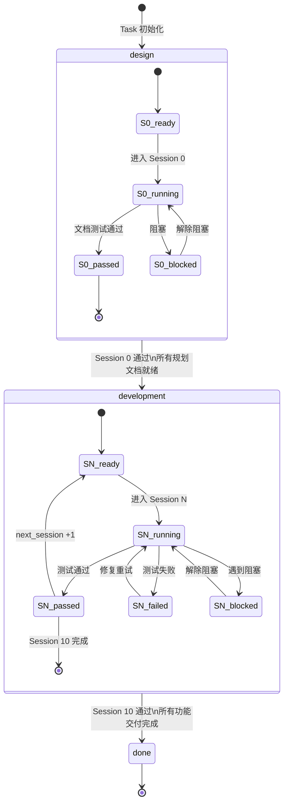
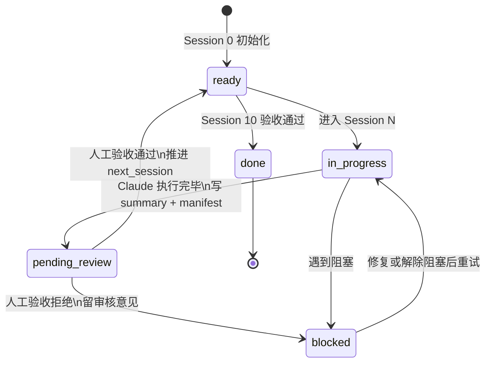
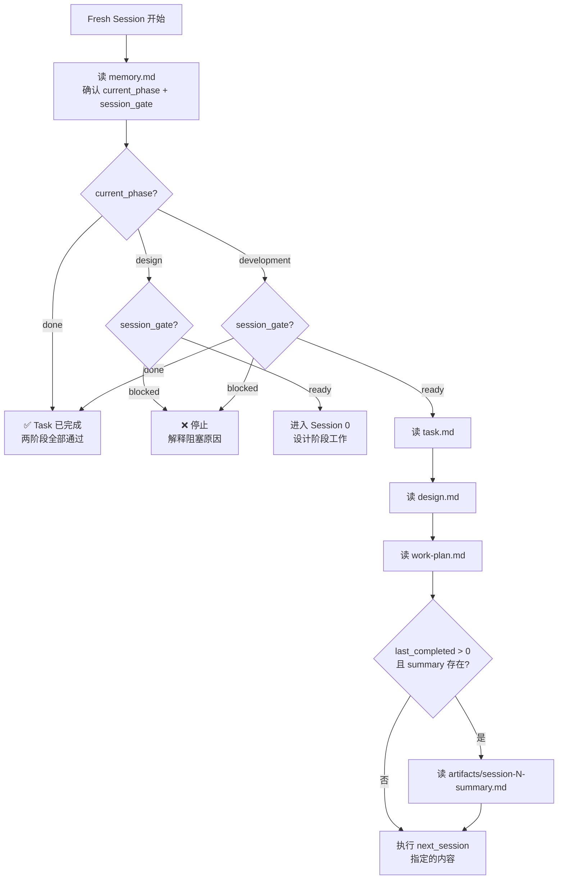

# memory.md

## 文件职责说明

`memory.md` 是 **Task 级** workflow 状态真相源，每个 Task 独立维护一份。
Driver 和 startup-prompt.md 都以此文件为路由依据，不依赖聊天历史。

---

## Session Status
- current_phase: design
- last_completed_session: none
- last_completed_session_tests: n/a
- next_session: 0
- next_session_prompt: `session-0-prompt.md`
- session_gate: ready
- review_notes: ""

## Phase Definitions

两阶段结构：

| Phase | Sessions | 目标 | 结束条件 |
|-------|----------|------|----------|
| `design` | Session 0 | 产出全部规划文档，不写业务代码 | Session 0 tests: passed |
| `development` | Session 1–10 | 按 Session 逐步实现功能 | Session 10 tests: passed |
| `done` | — | 流程全部完成 | — |

## Phase Transition Rule

- Session 0 完成 (`tests: passed`) → `current_phase: design` → `development`，`next_session: 1`
- Session 10 完成 (`tests: passed`) → `current_phase: development` → `done`，`session_gate: done`
- 任意 Session 未通过 → 不转换阶段，不推进 `next_session`

## Session Update Rule

每轮 Session 结束时必须更新：
- `current_phase`（若发生阶段转换）
- `last_completed_session`
- `last_completed_session_tests`
- `next_session`
- `next_session_prompt`
- `session_gate`

字段约定：
- `current_phase`: `design` / `development` / `done`
- `last_completed_session_tests`: `passed` / `failed` / `blocked`
- `session_gate`: `ready` / `in_progress` / `pending_review` / `blocked` / `done`

`pending_review` 说明：
- Claude 执行完 Session 后，`session_gate` 设为 `pending_review`
- 调度程序暂停，等待人工验收
- 验收通过 → 外部操作将 `session_gate` 改为 `ready`，驱动器继续推进
- 验收拒绝 → 外部操作将 `session_gate` 改为 `blocked`，Claude 重做本 Session

## Current Decisions
- 记录跨 Session 的稳定结论
- 不写未验证结论
- Task 级目标定义写入 `task.md`，不在此重复

## Known Risks
- 记录会影响后续判断的风险

## Session Artifacts
- session_0_outputs:
- session_1_outputs:
- session_2_outputs:
- session_3_outputs:

## Session Progress Record

每次 Session 结束时，至少记录：
- 本 Session 完成了什么
- 执行了哪些测试
- 测试结果：`passed` / `failed` / `blocked`
- 阶段变化：`current_phase` 是否发生转换
- 产出文件：`artifacts/session-N-summary.md` 和 `artifacts/session-N-manifest.json`
- 下一 Session 依赖哪些文件或产物

若本 Session 未完成：
- 不推进 `next_session`
- 不转换 `current_phase`
- 保持当前 Session 作为下一轮入口
- `session_gate` 设为 `blocked`

若本 Session 已完成：
- 先写 `artifacts/session-N-summary.md`（人类可读）
- 再写 `artifacts/session-N-manifest.json`（机器可验证）
- 再更新本文件：`session_gate: pending_review`（等待人工验收）
- 再结束当前会话
- 调度程序暂停，通知用户验收
- 用户验收通过 → 外部将 `session_gate` 改为 `ready` → 调度程序推进 `next_session`，启动下一个 Session
- 用户验收拒绝 → 外部将 `session_gate` 改为 `blocked`，填写 `review_notes` → 调度程序重新启动本 Session

## Next Session Entry

读取顺序（严格执行）：
- 先读 `Session Status`（确认 `current_phase` 和 `session_gate`）
- 再读 `task.md`
- 再读 `design.md`
- 再读 `work-plan.md`
- 若 `last_completed_session > 0` 且存在上一轮 summary，先读 `artifacts/session-N-summary.md`
- 然后只做 `next_session` 指定内容

