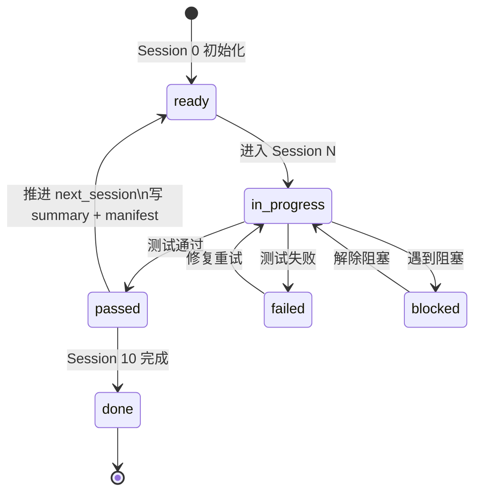
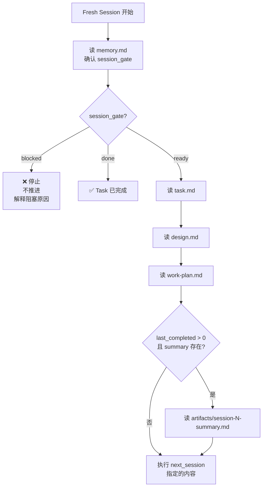

# memory.md

## 文件职责说明

`memory.md` 是 **Task 级** workflow 状态真相源，每个 Task 独立维护一份。
Driver 和 startup-prompt.md 都以此文件为路由依据，不依赖聊天历史。

---

## Session Status
- current_phase: planning
- last_completed_session: 0
- last_completed_session_tests: passed
- next_session: 1
- next_session_prompt: `session-1-prompt.md`
- session_gate: ready

## Session Update Rule
每轮 Session 结束时必须更新以下字段：
- `last_completed_session`
- `last_completed_session_tests`
- `next_session`
- `next_session_prompt`
- `session_gate`

字段约定：
- `last_completed_session_tests`: `passed` / `failed` / `blocked`
- `session_gate`: `ready` / `blocked` / `in_progress` / `done`

## Current Decisions
- 记录跨 Session 的稳定结论
- 不写未验证结论
- Task 级目标定义写入 `task.md`，不在此重复

## Known Risks
- 记录会影响后续判断的风险

## Session Artifacts
- session_0_outputs:
- session_1_outputs:
- session_2_outputs:
- session_3_outputs:

## Session Progress Record
每次 Session 结束时，至少记录：
- 本 Session 完成了什么
- 执行了哪些测试
- 测试结果：`passed` / `failed` / `blocked`
- 产出文件：`artifacts/session-N-summary.md` 和 `artifacts/session-N-manifest.json`
- 下一 Session 依赖哪些文件或产物

若本 Session 未完成：
- 不推进 `next_session`
- 保持当前 Session 作为下一轮入口
- `session_gate` 设为 `blocked`

若本 Session 已完成：
- 先写 `artifacts/session-N-summary.md`（人类可读）
- 再写 `artifacts/session-N-manifest.json`（机器可验证）
- 再更新本文件
- 再结���当前会话
- 再启动新的 Session / 新上下文
- 再从 `startup-prompt.md` 重新进入

## Next Session Entry
- 先读 `Session Status`
- 再读 `task.md`
- 再读 `design.md`
- 再读 `work-plan.md`
- 若 `last_completed_session > 0` 且存在上一轮 summary，先读 `artifacts/session-N-summary.md`
- 然后只做 `next_session` 指定内容

